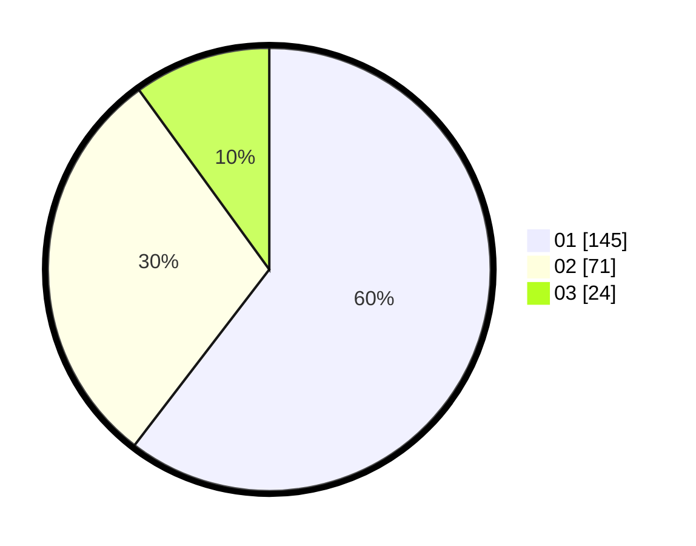

# Hasil

Hasil perolehan suara paslon dapat dilihat pada file paslon-01.txt, paslon-02.txt, dan paslon-03.txt.

Jika tidak ada, artinya data tersebut belum ada pada SIREKAP.

## Perolehan Suara

 * Paslon 01: **145**.
 * Paslon 02: **71**.
 * Paslon 03: **24**.

## Foto C Plano

https://sirekap-obj-formc.kpu.go.id/5cc0/pemilu/ppwp/31/75/03/10/06/3175031006004-20240214-214033--35c0859d-3d7c-4230-b1cf-a47d01464648.jpg

https://sirekap-obj-formc.kpu.go.id/5cc0/pemilu/ppwp/31/75/03/10/06/3175031006004-20240214-214233--bd24e6be-02fc-4ead-9f22-1f6a150c587c.jpg

https://sirekap-obj-formc.kpu.go.id/5cc0/pemilu/ppwp/31/75/03/10/06/3175031006004-20240214-214403--d57acc62-1d16-489f-accc-0fb4b196a6dd.jpg

## DATA PEMILIH TETAP

Jumlah pemilih dalam DPT: **293**.
 * L: **148**.
 * P: **145**.

## DATA PENGGUNA HAK PILIH

Jumlah pengguna hak pilih dalam DPT: **235**.
 * L: **111**.
 * P: **124**.

Jumlah pengguna hak pilih dalam DPTb: **2**.
 * L: **1**.
 * P: **1**.

Jumlah pengguna hak pilih dalam DPK: **5**.
 * L: **3**.
 * P: **2**.

Jumlah pengguna hak pilih: **242**.
 * L: **115**.
 * P: **127**.

## JUMLAH SUARA SAH DAN TIDAK SAH

JUMLAH SELURUH SUARA SAH: **240**.

JUMLAH SUARA TIDAK SAH: **2**.

JUMLAH SELURUH SUARA SAH DAN SUARA TIDAK SAH: **242**.
