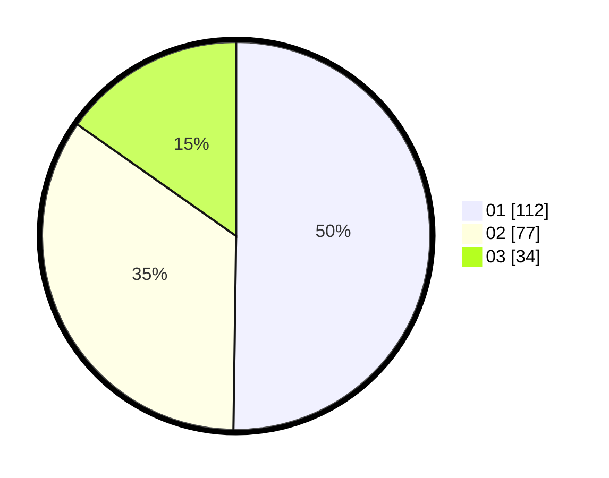

# Hasil

Hasil perolehan suara paslon dapat dilihat pada file paslon-01.txt, paslon-02.txt, dan paslon-03.txt.

Jika tidak ada, artinya data tersebut belum ada pada SIREKAP.

## Perolehan Suara

 * Paslon 01: **112**.
 * Paslon 02: **77**.
 * Paslon 03: **34**.

## Foto C Plano

https://sirekap-obj-formc.kpu.go.id/c7d7/pemilu/ppwp/31/75/03/10/06/3175031006010-20240214-213940--417433bc-2042-4d8f-861b-cacd6f321666.jpg

https://sirekap-obj-formc.kpu.go.id/c7d7/pemilu/ppwp/31/75/03/10/06/3175031006010-20240216-190128--79e805d6-87da-4bdc-8e2c-c6d0f698fb7d.jpg

https://sirekap-obj-formc.kpu.go.id/c7d7/pemilu/ppwp/31/75/03/10/06/3175031006010-20240214-214128--339f263d-9ed0-4f66-b1cc-9c0f4043acae.jpg

## DATA PEMILIH TETAP

Jumlah pemilih dalam DPT: **277**.
 * L: **139**.
 * P: **138**.

## DATA PENGGUNA HAK PILIH

Jumlah pengguna hak pilih dalam DPT: **216**.
 * L: **102**.
 * P: **114**.

Jumlah pengguna hak pilih dalam DPTb: **9**.
 * L: **4**.
 * P: **5**.

Jumlah pengguna hak pilih dalam DPK: **1**.
 * L: **0**.
 * P: **1**.

Jumlah pengguna hak pilih: **226**.
 * L: **106**.
 * P: **120**.

## JUMLAH SUARA SAH DAN TIDAK SAH

JUMLAH SELURUH SUARA SAH: **223**.

JUMLAH SUARA TIDAK SAH: **3**.

JUMLAH SELURUH SUARA SAH DAN SUARA TIDAK SAH: **226**.
