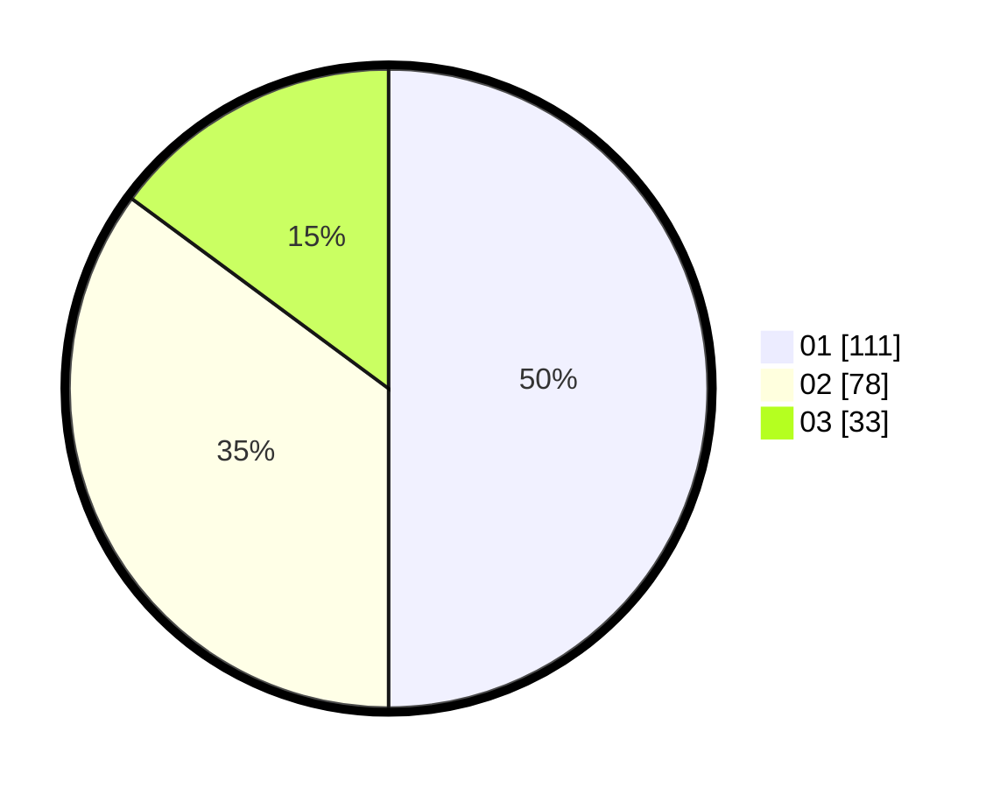

# Hasil

Hasil perolehan suara paslon dapat dilihat pada file paslon-01.txt, paslon-02.txt, dan paslon-03.txt.

Jika tidak ada, artinya data tersebut belum ada pada SIREKAP.

## Perolehan Suara

 * Paslon 01: **111**.
 * Paslon 02: **78**.
 * Paslon 03: **33**.

## Foto C Plano

https://sirekap-obj-formc.kpu.go.id/88f0/pemilu/ppwp/31/75/03/10/06/3175031006013-20240216-084630--29ee144a-899d-4bc1-a2aa-4eb28dc529f2.jpg

https://sirekap-obj-formc.kpu.go.id/88f0/pemilu/ppwp/31/75/03/10/06/3175031006013-20240216-084634--09b1d1a2-8f19-4aa7-b816-e14373235045.jpg

https://sirekap-obj-formc.kpu.go.id/88f0/pemilu/ppwp/31/75/03/10/06/3175031006013-20240216-084631--686e6fa1-568a-47eb-84a4-ceac8a4cc32a.jpg

## DATA PEMILIH TETAP

Jumlah pemilih dalam DPT: **289**.
 * L: **146**.
 * P: **143**.

## DATA PENGGUNA HAK PILIH

Jumlah pengguna hak pilih dalam DPT: **216**.
 * L: **102**.
 * P: **114**.

Jumlah pengguna hak pilih dalam DPTb: **2**.
 * L: **2**.
 * P: **0**.

Jumlah pengguna hak pilih dalam DPK: **4**.
 * L: **1**.
 * P: **3**.

Jumlah pengguna hak pilih: **222**.
 * L: **105**.
 * P: **117**.

## JUMLAH SUARA SAH DAN TIDAK SAH

JUMLAH SELURUH SUARA SAH: **222**.

JUMLAH SUARA TIDAK SAH: **3**.

JUMLAH SELURUH SUARA SAH DAN SUARA TIDAK SAH: **225**.
