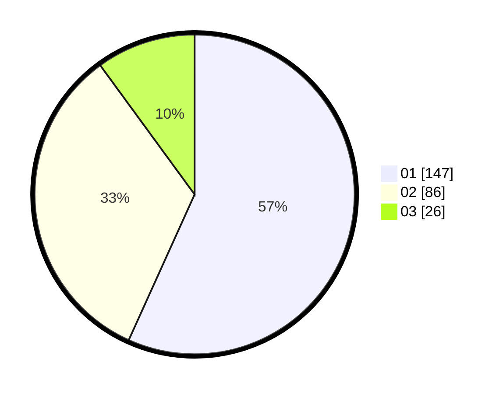

# Hasil

Hasil perolehan suara paslon dapat dilihat pada file paslon-01.txt, paslon-02.txt, dan paslon-03.txt.

Jika tidak ada, artinya data tersebut belum ada pada SIREKAP.

## Perolehan Suara

 * Paslon 01: **147**.
 * Paslon 02: **86**.
 * Paslon 03: **26**.

## Foto C Plano

https://sirekap-obj-formc.kpu.go.id/487b/pemilu/ppwp/31/75/03/10/06/3175031006016-20240215-100215--d4166ca6-7c69-4827-80c2-93469e38d123.jpg

https://sirekap-obj-formc.kpu.go.id/487b/pemilu/ppwp/31/75/03/10/06/3175031006016-20240215-100223--a7360a56-5859-46f8-bc4b-f23fa1648365.jpg

https://sirekap-obj-formc.kpu.go.id/487b/pemilu/ppwp/31/75/03/10/06/3175031006016-20240215-100228--6e211dc6-08b3-4c61-aa03-ab60cdefb4d6.jpg
