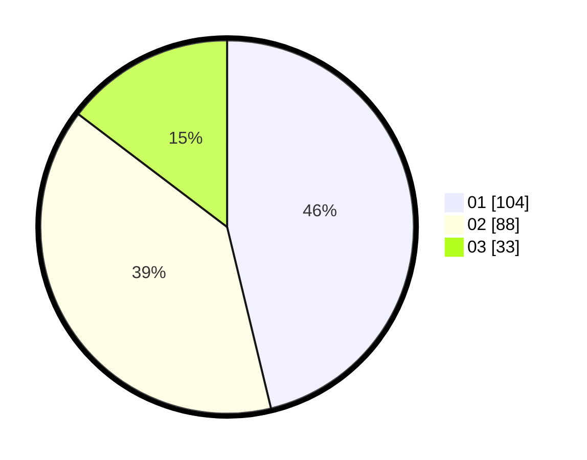

# Hasil

Hasil perolehan suara paslon dapat dilihat pada file paslon-01.txt, paslon-02.txt, dan paslon-03.txt.

Jika tidak ada, artinya data tersebut belum ada pada SIREKAP.

## Perolehan Suara

 * Paslon 01: **104**.
 * Paslon 02: **88**.
 * Paslon 03: **33**.

## Foto C Plano

https://sirekap-obj-formc.kpu.go.id/f54f/pemilu/ppwp/31/75/03/10/06/3175031006021-20240214-192624--bae2728a-1e94-46e5-87ac-e2b6316fd945.jpg

https://sirekap-obj-formc.kpu.go.id/f54f/pemilu/ppwp/31/75/03/10/06/3175031006021-20240214-192641--27243ead-92f5-4a9d-9e85-b778551d674b.jpg

https://sirekap-obj-formc.kpu.go.id/f54f/pemilu/ppwp/31/75/03/10/06/3175031006021-20240214-192659--10985142-3a61-4d36-8e73-746b7c84875d.jpg

## DATA PEMILIH TETAP

Jumlah pemilih dalam DPT: **292**.
 * L: **151**.
 * P: **141**.

## DATA PENGGUNA HAK PILIH

Jumlah pengguna hak pilih dalam DPT: **218**.
 * L: **115**.
 * P: **103**.

Jumlah pengguna hak pilih dalam DPTb: **5**.
 * L: **0**.
 * P: **5**.

Jumlah pengguna hak pilih dalam DPK: **4**.
 * L: **4**.
 * P: **0**.

Jumlah pengguna hak pilih: **227**.
 * L: **119**.
 * P: **108**.

## JUMLAH SUARA SAH DAN TIDAK SAH

JUMLAH SELURUH SUARA SAH: **225**.

JUMLAH SUARA TIDAK SAH: **2**.

JUMLAH SELURUH SUARA SAH DAN SUARA TIDAK SAH: **227**.
