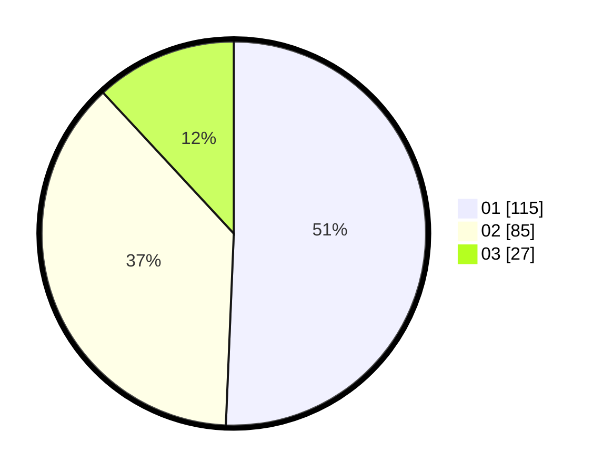

# Hasil

Hasil perolehan suara paslon dapat dilihat pada file paslon-01.txt, paslon-02.txt, dan paslon-03.txt.

Jika tidak ada, artinya data tersebut belum ada pada SIREKAP.

## Perolehan Suara

 * Paslon 01: **115**.
 * Paslon 02: **85**.
 * Paslon 03: **27**.

## Foto C Plano

https://sirekap-obj-formc.kpu.go.id/7e50/pemilu/ppwp/31/75/03/10/06/3175031006022-20240215-022307--b82d84d7-e07e-4a6b-ad63-89a0eeecb3c7.jpg

https://sirekap-obj-formc.kpu.go.id/7e50/pemilu/ppwp/31/75/03/10/06/3175031006022-20240215-022318--f55dd2d2-3433-4fe7-9e44-330f4f565cd5.jpg

https://sirekap-obj-formc.kpu.go.id/7e50/pemilu/ppwp/31/75/03/10/06/3175031006022-20240214-190314--91274f08-14e2-4bcc-94f4-ac37b1ceada0.jpg

## DATA PEMILIH TETAP

Jumlah pemilih dalam DPT: **288**.
 * L: **154**.
 * P: **134**.

## DATA PENGGUNA HAK PILIH

Jumlah pengguna hak pilih dalam DPT: **223**.
 * L: **119**.
 * P: **104**.

Jumlah pengguna hak pilih dalam DPTb: **4**.
 * L: **3**.
 * P: **1**.

Jumlah pengguna hak pilih dalam DPK: **0**.
 * L: **0**.
 * P: **0**.

Jumlah pengguna hak pilih: **227**.
 * L: **122**.
 * P: **105**.

## JUMLAH SUARA SAH DAN TIDAK SAH

JUMLAH SELURUH SUARA SAH: **227**.

JUMLAH SUARA TIDAK SAH: **0**.

JUMLAH SELURUH SUARA SAH DAN SUARA TIDAK SAH: **227**.
