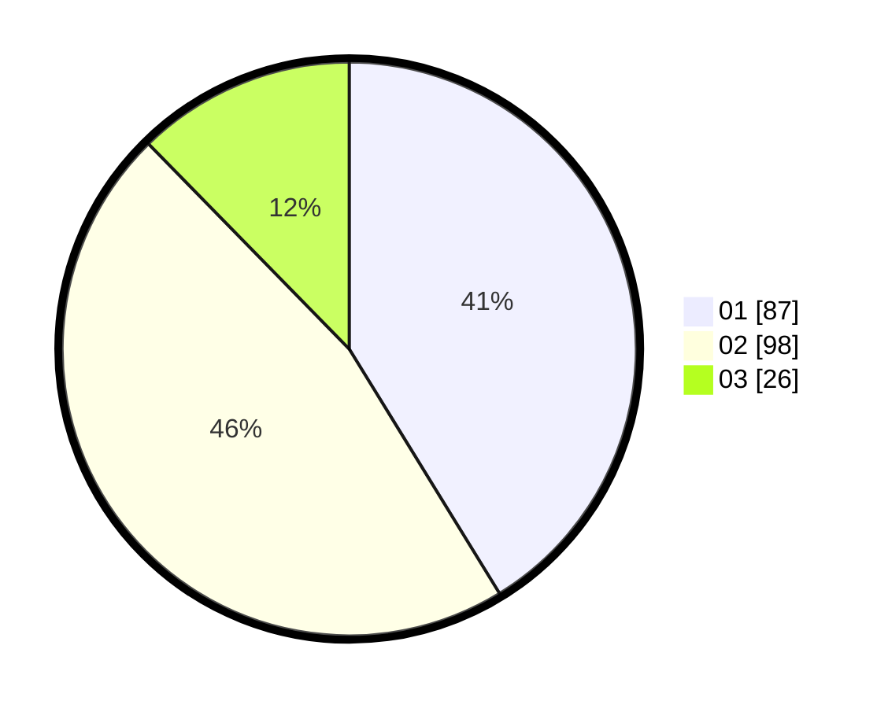

# Hasil

Hasil perolehan suara paslon dapat dilihat pada file paslon-01.txt, paslon-02.txt, dan paslon-03.txt.

Jika tidak ada, artinya data tersebut belum ada pada SIREKAP.

## Perolehan Suara

 * Paslon 01: **87**.
 * Paslon 02: **98**.
 * Paslon 03: **26**.

## Foto C Plano

https://sirekap-obj-formc.kpu.go.id/c0e9/pemilu/ppwp/31/75/03/10/06/3175031006023-20240214-211248--5111a07d-f045-4507-99cb-53ae406b70d1.jpg

https://sirekap-obj-formc.kpu.go.id/c0e9/pemilu/ppwp/31/75/03/10/06/3175031006023-20240214-203521--9ceb1722-ed50-420a-97a5-849fa04a4b14.jpg

https://sirekap-obj-formc.kpu.go.id/c0e9/pemilu/ppwp/31/75/03/10/06/3175031006023-20240214-211457--98603c54-2df5-491a-b28d-aaa35a8203b6.jpg
