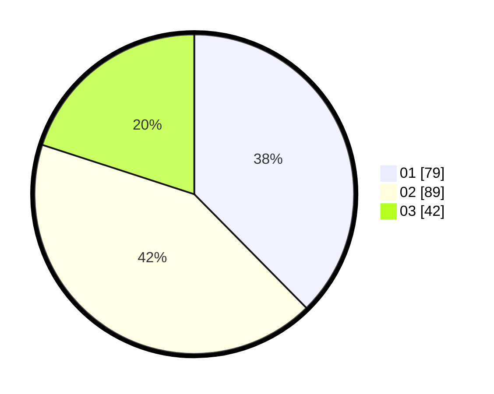

# Hasil

Hasil perolehan suara paslon dapat dilihat pada file paslon-01.txt, paslon-02.txt, dan paslon-03.txt.

Jika tidak ada, artinya data tersebut belum ada pada SIREKAP.

## Perolehan Suara

 * Paslon 01: **79**.
 * Paslon 02: **89**.
 * Paslon 03: **42**.

## Foto C Plano

https://sirekap-obj-formc.kpu.go.id/1887/pemilu/ppwp/31/75/03/10/06/3175031006025-20240214-232701--06021caa-82b7-46e5-93e8-673ce10d1f70.jpg

https://sirekap-obj-formc.kpu.go.id/1887/pemilu/ppwp/31/75/03/10/06/3175031006025-20240214-204611--79ed89b8-96e8-43d9-90e8-cddb3109fc50.jpg

https://sirekap-obj-formc.kpu.go.id/1887/pemilu/ppwp/31/75/03/10/06/3175031006025-20240214-204716--1e8b134e-5ff7-4985-b156-fc7b5d3071e0.jpg

## DATA PEMILIH TETAP

Jumlah pemilih dalam DPT: **263**.
 * L: **130**.
 * P: **133**.

## DATA PENGGUNA HAK PILIH

Jumlah pengguna hak pilih dalam DPT: **212**.
 * L: **103**.
 * P: **109**.

Jumlah pengguna hak pilih dalam DPTb: **2**.
 * L: **1**.
 * P: **1**.

Jumlah pengguna hak pilih dalam DPK: **0**.
 * L: **0**.
 * P: **0**.

Jumlah pengguna hak pilih: **214**.
 * L: **104**.
 * P: **110**.

## JUMLAH SUARA SAH DAN TIDAK SAH

JUMLAH SELURUH SUARA SAH: **210**.

JUMLAH SUARA TIDAK SAH: **4**.

JUMLAH SELURUH SUARA SAH DAN SUARA TIDAK SAH: **214**.
