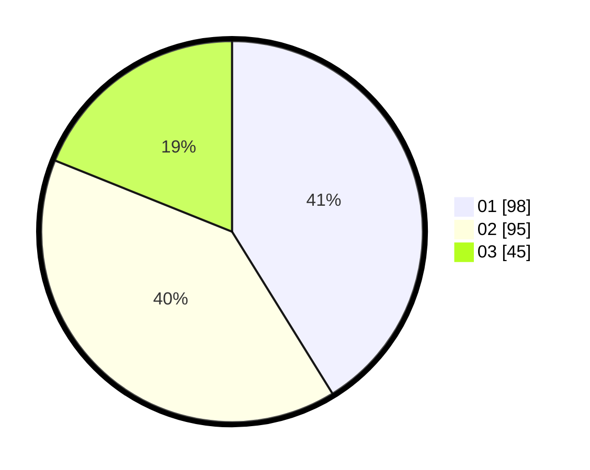

# Hasil

Hasil perolehan suara paslon dapat dilihat pada file paslon-01.txt, paslon-02.txt, dan paslon-03.txt.

Jika tidak ada, artinya data tersebut belum ada pada SIREKAP.

## Perolehan Suara

 * Paslon 01: **98**.
 * Paslon 02: **95**.
 * Paslon 03: **45**.

## Foto C Plano

https://sirekap-obj-formc.kpu.go.id/2977/pemilu/ppwp/31/75/03/10/06/3175031006029-20240214-235329--a931a7fb-34dc-4045-967c-8a2463e030c8.jpg

https://sirekap-obj-formc.kpu.go.id/2977/pemilu/ppwp/31/75/03/10/06/3175031006029-20240214-235627--b9be036b-b2b2-4449-8a8f-bc01fbe5cedb.jpg

https://sirekap-obj-formc.kpu.go.id/2977/pemilu/ppwp/31/75/03/10/06/3175031006029-20240214-235521--e4212c7a-739c-46c1-bd64-f19965b38a14.jpg
