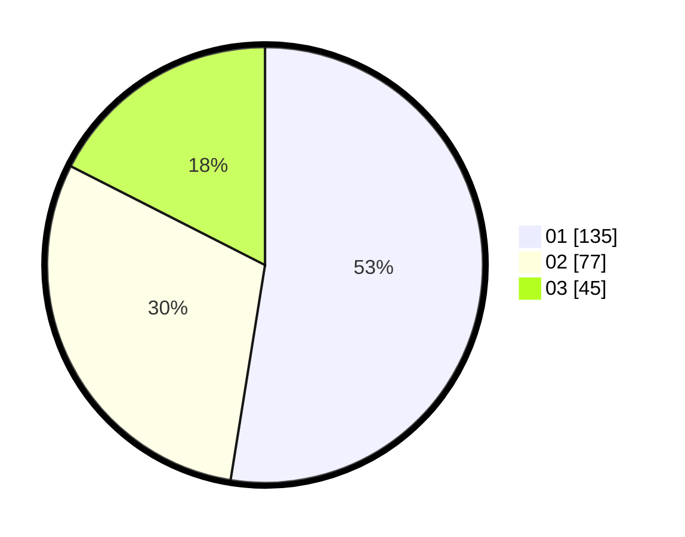

# Hasil

Hasil perolehan suara paslon dapat dilihat pada file paslon-01.txt, paslon-02.txt, dan paslon-03.txt.

Jika tidak ada, artinya data tersebut belum ada pada SIREKAP.

## Perolehan Suara

 * Paslon 01: **135**.
 * Paslon 02: **77**.
 * Paslon 03: **45**.

## Foto C Plano

https://sirekap-obj-formc.kpu.go.id/12a4/pemilu/ppwp/31/75/03/10/06/3175031006030-20240215-170859--55bfdb2b-a473-4c01-9494-3f534eae5b73.jpg

https://sirekap-obj-formc.kpu.go.id/12a4/pemilu/ppwp/31/75/03/10/06/3175031006030-20240217-004015--63cee774-d57d-46fb-af0c-56ab46e92ba7.jpg

https://sirekap-obj-formc.kpu.go.id/12a4/pemilu/ppwp/31/75/03/10/06/3175031006030-20240217-004040--f88df17c-1bc3-42d3-88aa-d7d88113ed00.jpg
