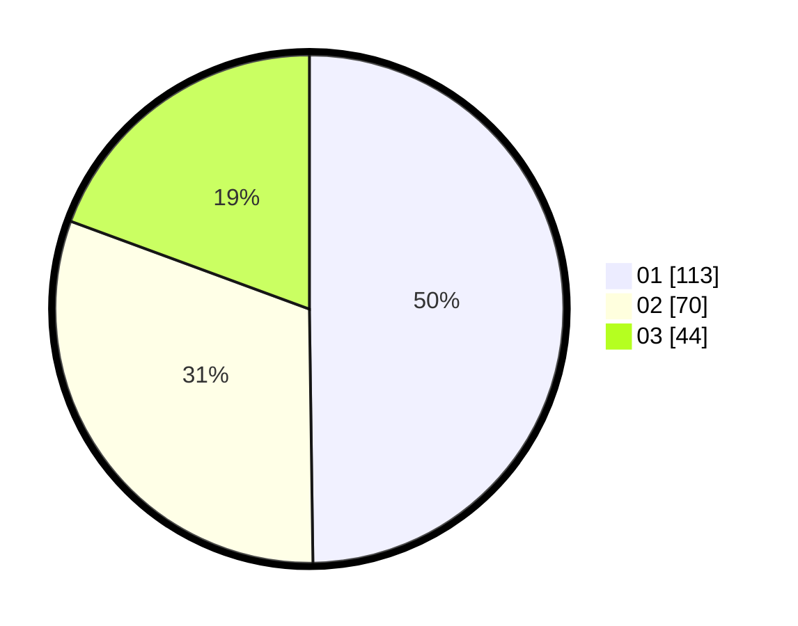

# Hasil

Hasil perolehan suara paslon dapat dilihat pada file paslon-01.txt, paslon-02.txt, dan paslon-03.txt.

Jika tidak ada, artinya data tersebut belum ada pada SIREKAP.

## Perolehan Suara

 * Paslon 01: **113**.
 * Paslon 02: **70**.
 * Paslon 03: **44**.

## Foto C Plano

https://sirekap-obj-formc.kpu.go.id/4e6d/pemilu/ppwp/31/75/03/10/06/3175031006033-20240214-235835--21ee117c-5888-4f1a-8320-c8eb510e50c3.jpg

https://sirekap-obj-formc.kpu.go.id/4e6d/pemilu/ppwp/31/75/03/10/06/3175031006033-20240214-205528--50940e00-4776-40f9-b116-9ab172ee70f4.jpg

https://sirekap-obj-formc.kpu.go.id/4e6d/pemilu/ppwp/31/75/03/10/06/3175031006033-20240214-205614--5167f62e-3ad6-465d-8502-0987c3b6814c.jpg
