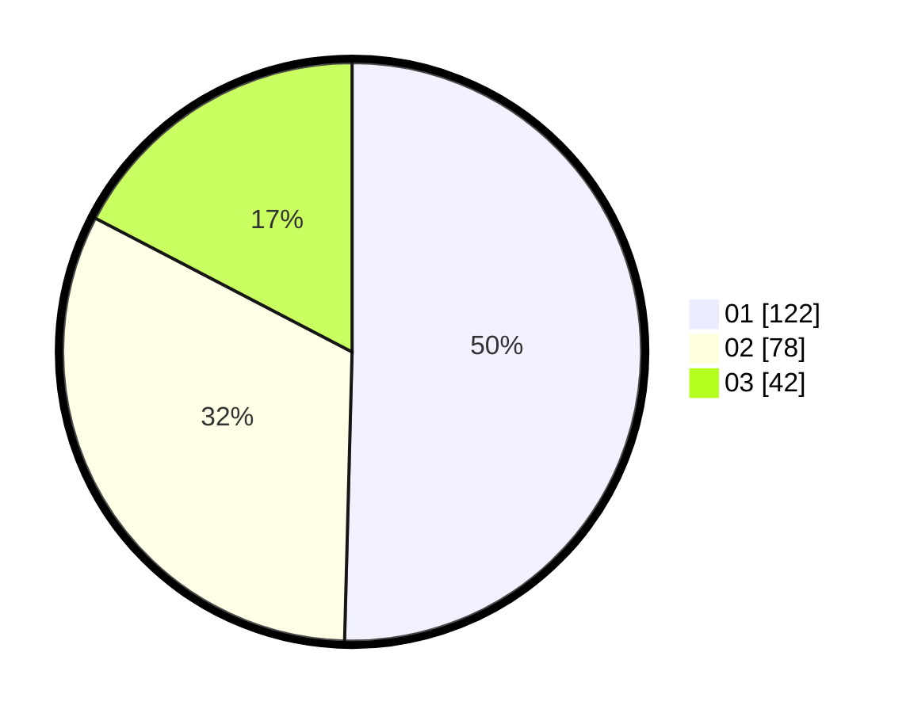

# Hasil

Hasil perolehan suara paslon dapat dilihat pada file paslon-01.txt, paslon-02.txt, dan paslon-03.txt.

Jika tidak ada, artinya data tersebut belum ada pada SIREKAP.

## Perolehan Suara

 * Paslon 01: **122**.
 * Paslon 02: **78**.
 * Paslon 03: **42**.

## Foto C Plano

https://sirekap-obj-formc.kpu.go.id/0946/pemilu/ppwp/31/75/03/10/06/3175031006036-20240214-211240--d2542196-ee4b-44d1-8dc3-eaea1024f596.jpg

https://sirekap-obj-formc.kpu.go.id/0946/pemilu/ppwp/31/75/03/10/06/3175031006036-20240214-202241--0d921ff4-99fb-4be1-8d28-bce6254d4296.jpg

https://sirekap-obj-formc.kpu.go.id/0946/pemilu/ppwp/31/75/03/10/06/3175031006036-20240214-202507--b8855c30-4528-43d6-b173-81476a8d8de4.jpg

## DATA PEMILIH TETAP

Jumlah pemilih dalam DPT: **283**.
 * L: **141**.
 * P: **142**.

## DATA PENGGUNA HAK PILIH

Jumlah pengguna hak pilih dalam DPT: **233**.
 * L: **120**.
 * P: **113**.

Jumlah pengguna hak pilih dalam DPTb: **1**.
 * L: **1**.
 * P: **0**.

Jumlah pengguna hak pilih dalam DPK: **9**.
 * L: **5**.
 * P: **4**.

Jumlah pengguna hak pilih: **243**.
 * L: **0**.
 * P: **0**.

## JUMLAH SUARA SAH DAN TIDAK SAH

JUMLAH SELURUH SUARA SAH: **242**.

JUMLAH SUARA TIDAK SAH: **1**.

JUMLAH SELURUH SUARA SAH DAN SUARA TIDAK SAH: **243**.
