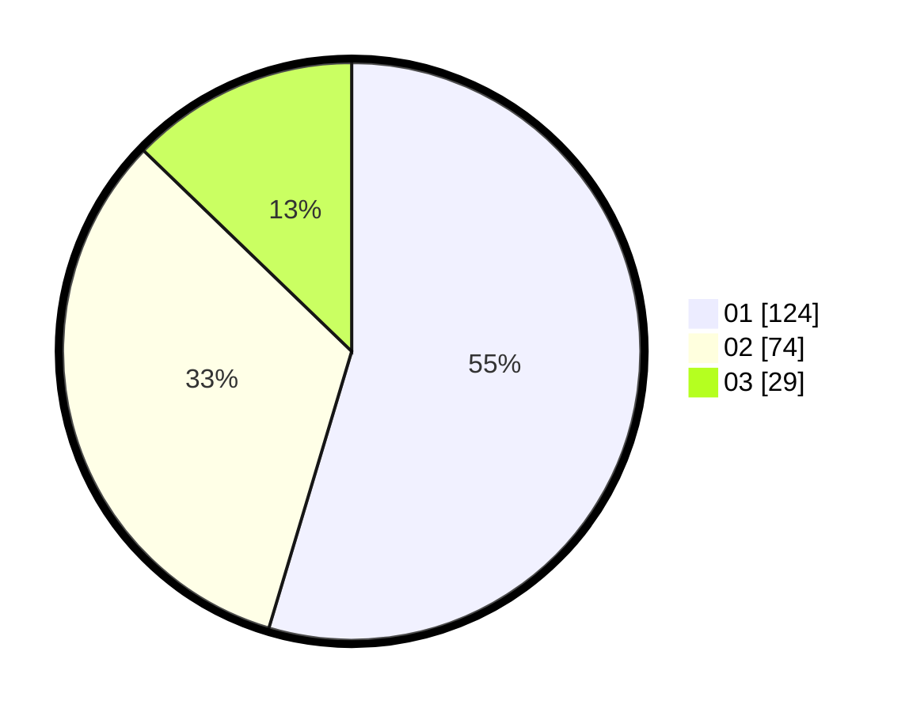

# Hasil

Hasil perolehan suara paslon dapat dilihat pada file paslon-01.txt, paslon-02.txt, dan paslon-03.txt.

Jika tidak ada, artinya data tersebut belum ada pada SIREKAP.

## Perolehan Suara

 * Paslon 01: **124**.
 * Paslon 02: **74**.
 * Paslon 03: **29**.

## Foto C Plano

https://sirekap-obj-formc.kpu.go.id/390f/pemilu/ppwp/31/75/03/10/06/3175031006037-20240214-224332--3b554894-e63d-4c1e-9b08-6eedd1c237b1.jpg

https://sirekap-obj-formc.kpu.go.id/390f/pemilu/ppwp/31/75/03/10/06/3175031006037-20240214-224519--7bba1e77-1196-407b-b2af-1221d63f6565.jpg

https://sirekap-obj-formc.kpu.go.id/390f/pemilu/ppwp/31/75/03/10/06/3175031006037-20240214-224619--449d2270-25bd-4f26-899e-8a91fa2525e9.jpg
