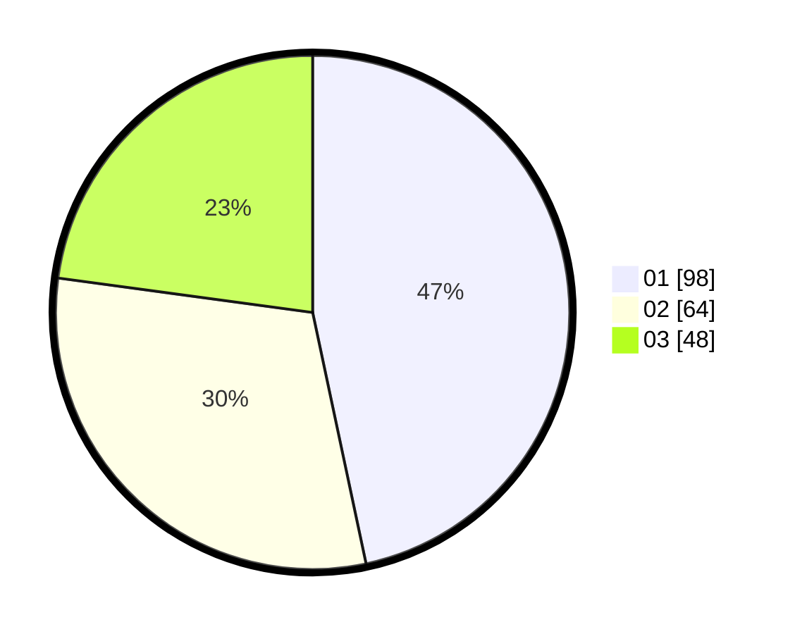

# Hasil

Hasil perolehan suara paslon dapat dilihat pada file paslon-01.txt, paslon-02.txt, dan paslon-03.txt.

Jika tidak ada, artinya data tersebut belum ada pada SIREKAP.

## Perolehan Suara

 * Paslon 01: **98**.
 * Paslon 02: **64**.
 * Paslon 03: **48**.

## Foto C Plano

https://sirekap-obj-formc.kpu.go.id/752a/pemilu/ppwp/31/75/03/10/06/3175031006039-20240215-230809--2b9c7e7c-9fc0-40c8-aa40-feb6708efcc4.jpg

https://sirekap-obj-formc.kpu.go.id/752a/pemilu/ppwp/31/75/03/10/06/3175031006039-20240216-205548--85588340-45a3-41a3-853e-fa5c5499f82e.jpg

https://sirekap-obj-formc.kpu.go.id/752a/pemilu/ppwp/31/75/03/10/06/3175031006039-20240216-045505--adc49660-4b78-4105-abf4-a6aec590f8dc.jpg

## DATA PEMILIH TETAP

Jumlah pemilih dalam DPT: **272**.
 * L: **141**.
 * P: **131**.

## DATA PENGGUNA HAK PILIH

Jumlah pengguna hak pilih dalam DPT: **213**.
 * L: **111**.
 * P: **102**.

Jumlah pengguna hak pilih dalam DPTb: **2**.
 * L: **1**.
 * P: **1**.

Jumlah pengguna hak pilih dalam DPK: **0**.
 * L: **0**.
 * P: **1**.

Jumlah pengguna hak pilih: **216**.
 * L: **112**.
 * P: **104**.

## JUMLAH SUARA SAH DAN TIDAK SAH

JUMLAH SELURUH SUARA SAH: **210**.

JUMLAH SUARA TIDAK SAH: **6**.

JUMLAH SELURUH SUARA SAH DAN SUARA TIDAK SAH: **216**.
