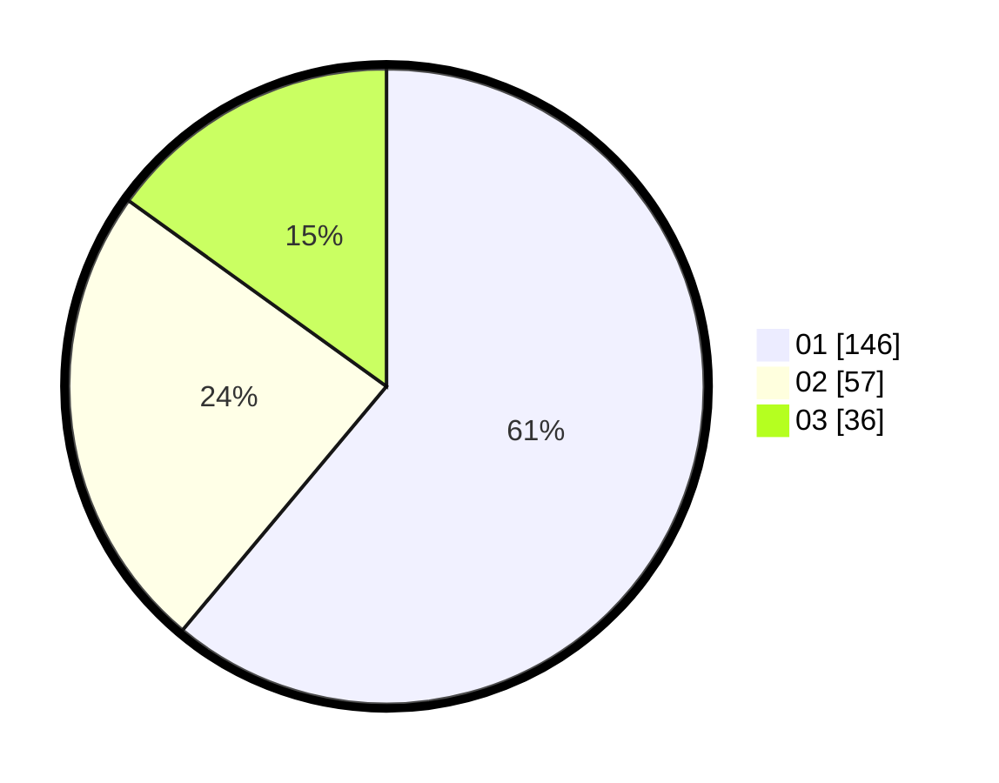

# Hasil

Hasil perolehan suara paslon dapat dilihat pada file paslon-01.txt, paslon-02.txt, dan paslon-03.txt.

Jika tidak ada, artinya data tersebut belum ada pada SIREKAP.

## Perolehan Suara

 * Paslon 01: **146**.
 * Paslon 02: **57**.
 * Paslon 03: **36**.

## Foto C Plano

https://sirekap-obj-formc.kpu.go.id/b243/pemilu/ppwp/31/75/03/10/06/3175031006041-20240214-193030--d44f14f9-8d1b-4da1-b736-68c2055306b9.jpg

https://sirekap-obj-formc.kpu.go.id/b243/pemilu/ppwp/31/75/03/10/06/3175031006041-20240214-193218--7d05a42c-3ac2-4469-b9b8-65c7e5e76b97.jpg

https://sirekap-obj-formc.kpu.go.id/b243/pemilu/ppwp/31/75/03/10/06/3175031006041-20240214-193344--829217aa-9043-42f6-9407-55f41af3c183.jpg

## DATA PEMILIH TETAP

Jumlah pemilih dalam DPT: **291**.
 * L: **145**.
 * P: **146**.

## DATA PENGGUNA HAK PILIH

Jumlah pengguna hak pilih dalam DPT: **238**.
 * L: **121**.
 * P: **117**.

Jumlah pengguna hak pilih dalam DPTb: **2**.
 * L: **2**.
 * P: **0**.

Jumlah pengguna hak pilih dalam DPK: **3**.
 * L: **1**.
 * P: **2**.

Jumlah pengguna hak pilih: **243**.
 * L: **124**.
 * P: **119**.

## JUMLAH SUARA SAH DAN TIDAK SAH

JUMLAH SELURUH SUARA SAH: **239**.

JUMLAH SUARA TIDAK SAH: **4**.

JUMLAH SELURUH SUARA SAH DAN SUARA TIDAK SAH: **243**.
