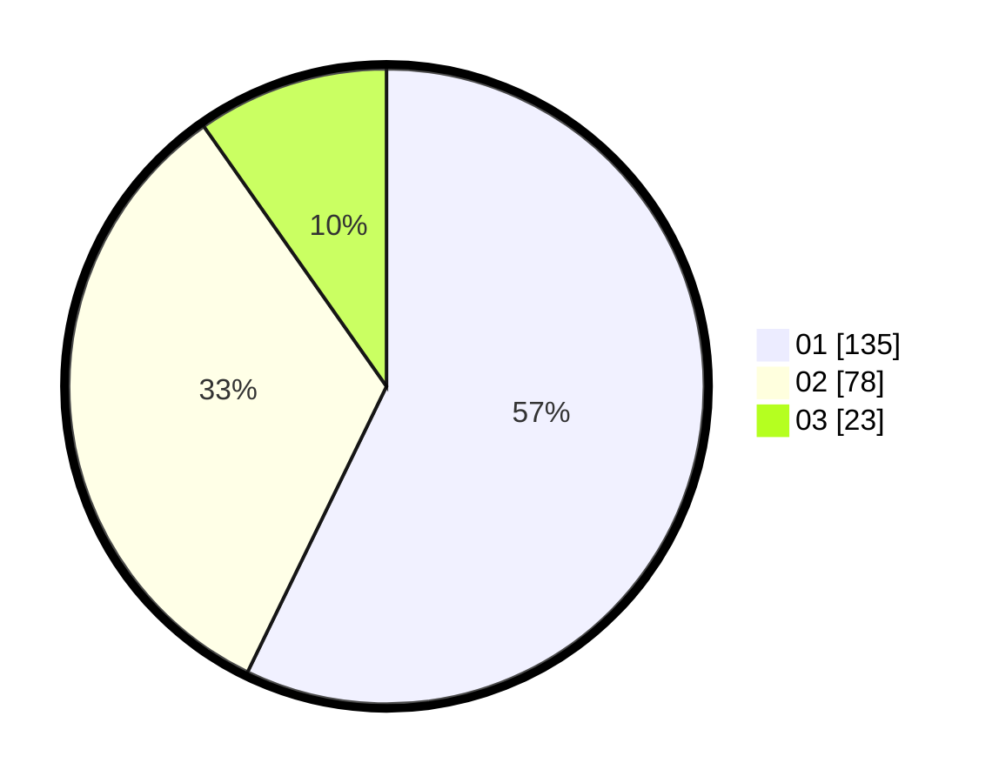

# Hasil

Hasil perolehan suara paslon dapat dilihat pada file paslon-01.txt, paslon-02.txt, dan paslon-03.txt.

Jika tidak ada, artinya data tersebut belum ada pada SIREKAP.

## Perolehan Suara

 * Paslon 01: **135**.
 * Paslon 02: **78**.
 * Paslon 03: **23**.

## Foto C Plano

https://sirekap-obj-formc.kpu.go.id/0dff/pemilu/ppwp/31/75/03/10/06/3175031006042-20240214-185605--b6e32e6b-e17e-4512-be96-591a226acb00.jpg

https://sirekap-obj-formc.kpu.go.id/0dff/pemilu/ppwp/31/75/03/10/06/3175031006042-20240214-185645--defcf1b9-da41-49e3-bacf-cdf89fb0c568.jpg

https://sirekap-obj-formc.kpu.go.id/0dff/pemilu/ppwp/31/75/03/10/06/3175031006042-20240214-184514--2b53da49-49dd-4d3f-a4d0-b1a6504a1013.jpg

## DATA PEMILIH TETAP

Jumlah pemilih dalam DPT: **292**.
 * L: **148**.
 * P: **144**.

## DATA PENGGUNA HAK PILIH

Jumlah pengguna hak pilih dalam DPT: **240**.
 * L: **118**.
 * P: **122**.

Jumlah pengguna hak pilih dalam DPTb: **1**.
 * L: **0**.
 * P: **1**.

Jumlah pengguna hak pilih dalam DPK: **0**.
 * L: **0**.
 * P: **0**.

Jumlah pengguna hak pilih: **241**.
 * L: **118**.
 * P: **123**.

## JUMLAH SUARA SAH DAN TIDAK SAH

JUMLAH SELURUH SUARA SAH: **236**.

JUMLAH SUARA TIDAK SAH: **5**.

JUMLAH SELURUH SUARA SAH DAN SUARA TIDAK SAH: **241**.
