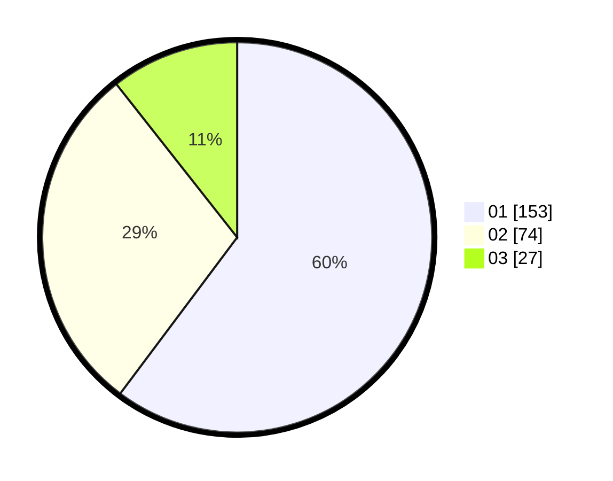

# Hasil

Hasil perolehan suara paslon dapat dilihat pada file paslon-01.txt, paslon-02.txt, dan paslon-03.txt.

Jika tidak ada, artinya data tersebut belum ada pada SIREKAP.

## Perolehan Suara

 * Paslon 01: **153**.
 * Paslon 02: **74**.
 * Paslon 03: **27**.

## Foto C Plano

https://sirekap-obj-formc.kpu.go.id/446b/pemilu/ppwp/31/75/03/10/06/3175031006043-20240214-224015--4157637a-2e3c-4894-9ecb-93e7c1d42960.jpg

https://sirekap-obj-formc.kpu.go.id/446b/pemilu/ppwp/31/75/03/10/06/3175031006043-20240214-211934--d4000d12-3eba-40a0-9eab-7d3f9a1d9851.jpg

https://sirekap-obj-formc.kpu.go.id/446b/pemilu/ppwp/31/75/03/10/06/3175031006043-20240214-212550--a8242328-e552-48df-8ddf-9f019c7bcace.jpg

## DATA PEMILIH TETAP

Jumlah pemilih dalam DPT: **293**.
 * L: **142**.
 * P: **151**.

## DATA PENGGUNA HAK PILIH

Jumlah pengguna hak pilih dalam DPT: **251**.
 * L: **114**.
 * P: **137**.

Jumlah pengguna hak pilih dalam DPTb: **2**.
 * L: **1**.
 * P: **1**.

Jumlah pengguna hak pilih dalam DPK: **4**.
 * L: **3**.
 * P: **1**.

Jumlah pengguna hak pilih: **257**.
 * L: **118**.
 * P: **139**.

## JUMLAH SUARA SAH DAN TIDAK SAH

JUMLAH SELURUH SUARA SAH: **254**.

JUMLAH SUARA TIDAK SAH: **3**.

JUMLAH SELURUH SUARA SAH DAN SUARA TIDAK SAH: **257**.
