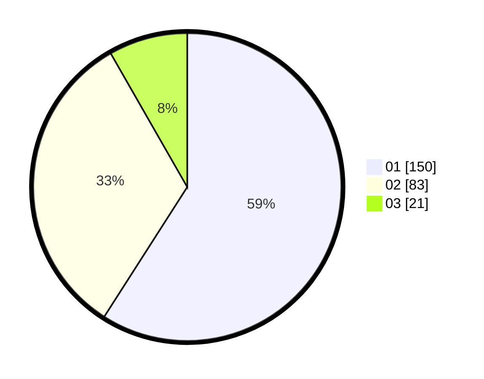

# Hasil

Hasil perolehan suara paslon dapat dilihat pada file paslon-01.txt, paslon-02.txt, dan paslon-03.txt.

Jika tidak ada, artinya data tersebut belum ada pada SIREKAP.

## Perolehan Suara

 * Paslon 01: **150**.
 * Paslon 02: **83**.
 * Paslon 03: **21**.

## Foto C Plano

https://sirekap-obj-formc.kpu.go.id/9a97/pemilu/ppwp/31/75/03/10/06/3175031006049-20240214-194524--1309468c-1534-4167-9715-82d674d0d42d.jpg

https://sirekap-obj-formc.kpu.go.id/9a97/pemilu/ppwp/31/75/03/10/06/3175031006049-20240214-155008--60aff949-9abe-46bf-8650-0a693cd7b32a.jpg
