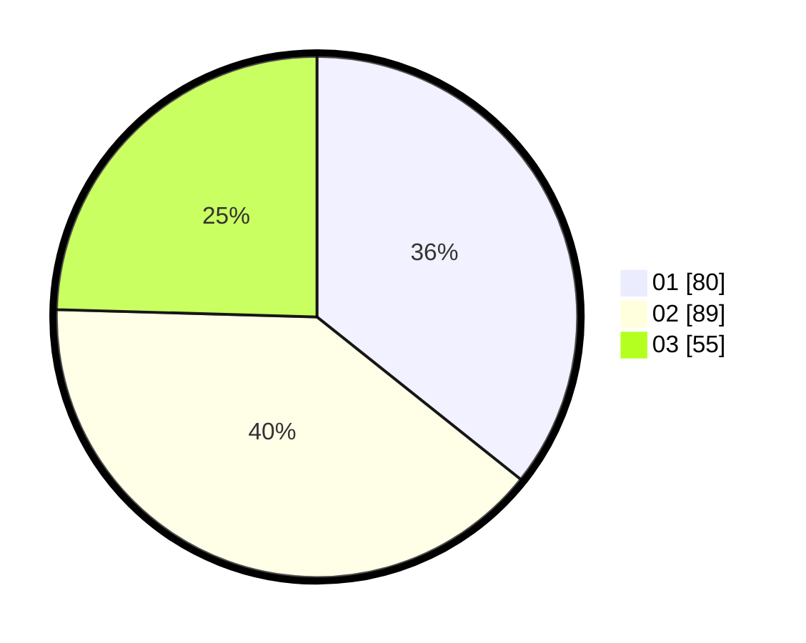

# Hasil

Hasil perolehan suara paslon dapat dilihat pada file paslon-01.txt, paslon-02.txt, dan paslon-03.txt.

Jika tidak ada, artinya data tersebut belum ada pada SIREKAP.

## Perolehan Suara

 * Paslon 01: **80**.
 * Paslon 02: **89**.
 * Paslon 03: **55**.

## Foto C Plano

https://sirekap-obj-formc.kpu.go.id/4ccb/pemilu/ppwp/31/75/03/10/06/3175031006056-20240214-192041--655ff8a4-858b-4149-b0d3-8bf5dea7981d.jpg

https://sirekap-obj-formc.kpu.go.id/4ccb/pemilu/ppwp/31/75/03/10/06/3175031006056-20240214-155047--5defd324-238c-40d2-89a8-560e233869a7.jpg

https://sirekap-obj-formc.kpu.go.id/4ccb/pemilu/ppwp/31/75/03/10/06/3175031006056-20240214-155138--b602cb67-0a97-4284-b5ff-8af69a5c5fd8.jpg

## DATA PEMILIH TETAP

Jumlah pemilih dalam DPT: **284**.
 * L: **140**.
 * P: **144**.

## DATA PENGGUNA HAK PILIH

Jumlah pengguna hak pilih dalam DPT: **221**.
 * L: **110**.
 * P: **111**.

Jumlah pengguna hak pilih dalam DPTb: **3**.
 * L: **2**.
 * P: **1**.

Jumlah pengguna hak pilih dalam DPK: **3**.
 * L: **1**.
 * P: **2**.

Jumlah pengguna hak pilih: **227**.
 * L: **113**.
 * P: **114**.

## JUMLAH SUARA SAH DAN TIDAK SAH

JUMLAH SELURUH SUARA SAH: **224**.

JUMLAH SUARA TIDAK SAH: **3**.

JUMLAH SELURUH SUARA SAH DAN SUARA TIDAK SAH: **227**.
