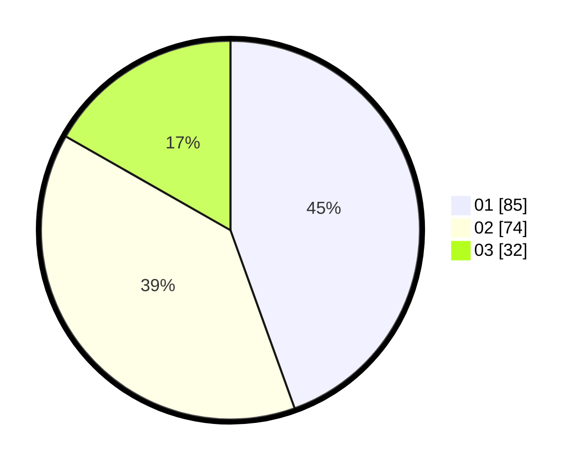

# Hasil

Hasil perolehan suara paslon dapat dilihat pada file paslon-01.txt, paslon-02.txt, dan paslon-03.txt.

Jika tidak ada, artinya data tersebut belum ada pada SIREKAP.

## Perolehan Suara

 * Paslon 01: **85**.
 * Paslon 02: **74**.
 * Paslon 03: **32**.

## Foto C Plano

https://sirekap-obj-formc.kpu.go.id/7bd9/pemilu/ppwp/31/75/03/10/06/3175031006057-20240215-211106--67102c6d-6320-43e6-949d-ed1c3aca5280.jpg

https://sirekap-obj-formc.kpu.go.id/7bd9/pemilu/ppwp/31/75/03/10/06/3175031006057-20240215-211108--cc6e4cde-1d09-44a8-94de-b411f7060574.jpg

https://sirekap-obj-formc.kpu.go.id/7bd9/pemilu/ppwp/31/75/03/10/06/3175031006057-20240215-211107--778d14d7-616c-48bf-b361-dd569fcbd95d.jpg

## DATA PEMILIH TETAP

Jumlah pemilih dalam DPT: **233**.
 * L: **120**.
 * P: **113**.

## DATA PENGGUNA HAK PILIH

Jumlah pengguna hak pilih dalam DPT: **188**.
 * L: **87**.
 * P: **101**.

Jumlah pengguna hak pilih dalam DPTb: **0**.
 * L: **0**.
 * P: **0**.

Jumlah pengguna hak pilih dalam DPK: **5**.
 * L: **3**.
 * P: **2**.

Jumlah pengguna hak pilih: **193**.
 * L: **90**.
 * P: **103**.

## JUMLAH SUARA SAH DAN TIDAK SAH

JUMLAH SELURUH SUARA SAH: **191**.

JUMLAH SUARA TIDAK SAH: **2**.

JUMLAH SELURUH SUARA SAH DAN SUARA TIDAK SAH: **193**.
