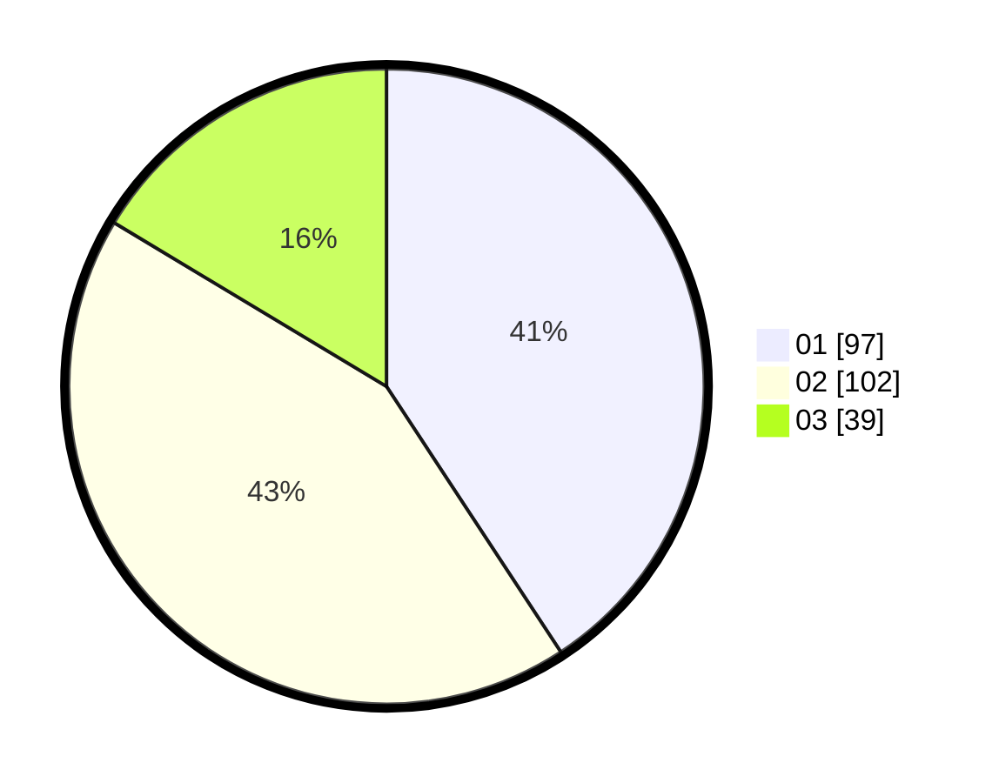

# Hasil

Hasil perolehan suara paslon dapat dilihat pada file paslon-01.txt, paslon-02.txt, dan paslon-03.txt.

Jika tidak ada, artinya data tersebut belum ada pada SIREKAP.

## Perolehan Suara

 * Paslon 01: **97**.
 * Paslon 02: **102**.
 * Paslon 03: **39**.

## Foto C Plano

https://sirekap-obj-formc.kpu.go.id/7381/pemilu/ppwp/31/75/03/10/06/3175031006058-20240214-234831--2235d8db-605e-4ca4-8f3e-3ebde4e8156d.jpg

https://sirekap-obj-formc.kpu.go.id/7381/pemilu/ppwp/31/75/03/10/06/3175031006058-20240216-192308--5b473c96-82c6-4827-8287-b7eee8c76259.jpg

https://sirekap-obj-formc.kpu.go.id/7381/pemilu/ppwp/31/75/03/10/06/3175031006058-20240216-233935--3dfb6719-ddb6-48b6-9321-f49580d5b3d9.jpg

## DATA PEMILIH TETAP

Jumlah pemilih dalam DPT: **295**.
 * L: **132**.
 * P: **163**.

## DATA PENGGUNA HAK PILIH

Jumlah pengguna hak pilih dalam DPT: **241**.
 * L: **104**.
 * P: **137**.

Jumlah pengguna hak pilih dalam DPTb: **3**.
 * L: **1**.
 * P: **2**.

Jumlah pengguna hak pilih dalam DPK: **0**.
 * L: **0**.
 * P: **0**.

Jumlah pengguna hak pilih: **244**.
 * L: **105**.
 * P: **139**.

## JUMLAH SUARA SAH DAN TIDAK SAH

JUMLAH SELURUH SUARA SAH: **238**.

JUMLAH SUARA TIDAK SAH: **6**.

JUMLAH SELURUH SUARA SAH DAN SUARA TIDAK SAH: **244**.
