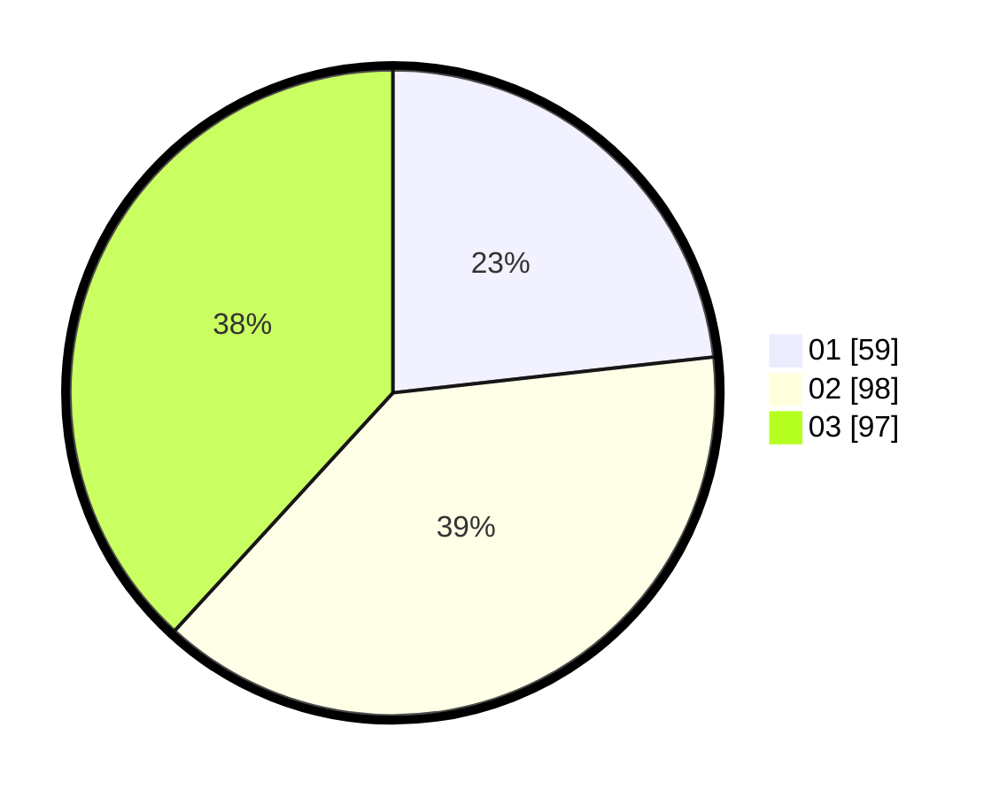

# Hasil

Hasil perolehan suara paslon dapat dilihat pada file paslon-01.txt, paslon-02.txt, dan paslon-03.txt.

Jika tidak ada, artinya data tersebut belum ada pada SIREKAP.

## Perolehan Suara

 * Paslon 01: **59**.
 * Paslon 02: **98**.
 * Paslon 03: **97**.

## Foto C Plano

https://sirekap-obj-formc.kpu.go.id/8a74/pemilu/ppwp/31/75/03/10/06/3175031006064-20240214-193033--7d9b0884-ad32-4631-9fe3-2186e6ebb255.jpg

https://sirekap-obj-formc.kpu.go.id/8a74/pemilu/ppwp/31/75/03/10/06/3175031006064-20240214-193038--221b2c5d-827c-41c4-85e7-03c2223a366e.jpg

https://sirekap-obj-formc.kpu.go.id/8a74/pemilu/ppwp/31/75/03/10/06/3175031006064-20240214-193043--52162880-ef98-4661-8c31-dee2b71e2b54.jpg
