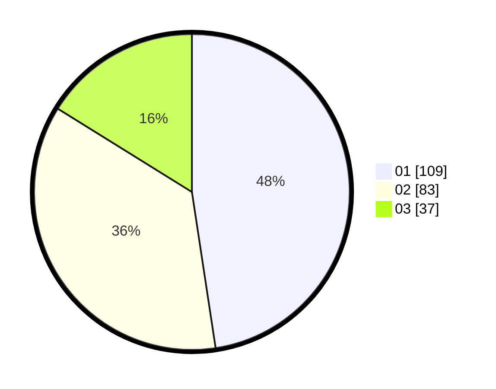

# Hasil

Hasil perolehan suara paslon dapat dilihat pada file paslon-01.txt, paslon-02.txt, dan paslon-03.txt.

Jika tidak ada, artinya data tersebut belum ada pada SIREKAP.

## Perolehan Suara

 * Paslon 01: **109**.
 * Paslon 02: **83**.
 * Paslon 03: **37**.

## Foto C Plano

https://sirekap-obj-formc.kpu.go.id/ba6c/pemilu/ppwp/31/75/03/10/06/3175031006077-20240214-155843--27ec3fc1-35be-42f5-8bbe-9270c9e75923.jpg

https://sirekap-obj-formc.kpu.go.id/ba6c/pemilu/ppwp/31/75/03/10/06/3175031006077-20240216-043400--33c59243-3d63-4309-a249-a7627b220fcd.jpg

https://sirekap-obj-formc.kpu.go.id/ba6c/pemilu/ppwp/31/75/03/10/06/3175031006077-20240214-190651--465a9108-29e0-417f-ae01-c33d1ba43551.jpg

## DATA PEMILIH TETAP

Jumlah pemilih dalam DPT: **298**.
 * L: **141**.
 * P: **157**.

## DATA PENGGUNA HAK PILIH

Jumlah pengguna hak pilih dalam DPT: **235**.
 * L: **106**.
 * P: **129**.

Jumlah pengguna hak pilih dalam DPTb: **0**.
 * L: **0**.
 * P: **0**.

Jumlah pengguna hak pilih dalam DPK: **3**.
 * L: **2**.
 * P: **1**.

Jumlah pengguna hak pilih: **238**.
 * L: **108**.
 * P: **130**.

## JUMLAH SUARA SAH DAN TIDAK SAH

JUMLAH SELURUH SUARA SAH: **229**.

JUMLAH SUARA TIDAK SAH: **9**.

JUMLAH SELURUH SUARA SAH DAN SUARA TIDAK SAH: **238**.
