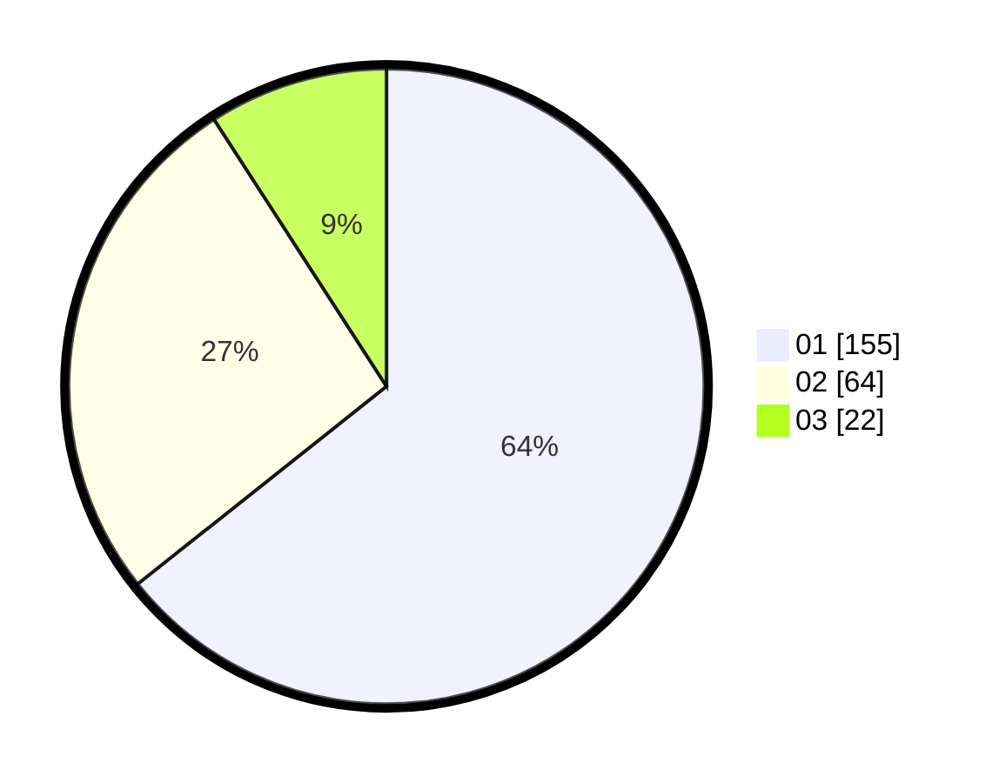

# Hasil

Hasil perolehan suara paslon dapat dilihat pada file paslon-01.txt, paslon-02.txt, dan paslon-03.txt.

Jika tidak ada, artinya data tersebut belum ada pada SIREKAP.

## Perolehan Suara

 * Paslon 01: **155**.
 * Paslon 02: **64**.
 * Paslon 03: **22**.

## Foto C Plano

https://sirekap-obj-formc.kpu.go.id/7775/pemilu/ppwp/31/75/03/10/06/3175031006079-20240214-193358--15454937-dd17-4a80-8697-9201e4d673f1.jpg

https://sirekap-obj-formc.kpu.go.id/7775/pemilu/ppwp/31/75/03/10/06/3175031006079-20240214-193414--92fbd436-bcb7-4353-b3ce-19133ad47af0.jpg

https://sirekap-obj-formc.kpu.go.id/7775/pemilu/ppwp/31/75/03/10/06/3175031006079-20240214-193236--ac0338bd-8a82-4a68-803a-1158e9d6c8bb.jpg

## DATA PEMILIH TETAP

Jumlah pemilih dalam DPT: **296**.
 * L: **147**.
 * P: **149**.

## DATA PENGGUNA HAK PILIH

Jumlah pengguna hak pilih dalam DPT: **237**.
 * L: **115**.
 * P: **122**.

Jumlah pengguna hak pilih dalam DPTb: **3**.
 * L: **1**.
 * P: **2**.

Jumlah pengguna hak pilih dalam DPK: **3**.
 * L: **3**.
 * P: **0**.

Jumlah pengguna hak pilih: **243**.
 * L: **119**.
 * P: **124**.

## JUMLAH SUARA SAH DAN TIDAK SAH

JUMLAH SELURUH SUARA SAH: **241**.

JUMLAH SUARA TIDAK SAH: **2**.

JUMLAH SELURUH SUARA SAH DAN SUARA TIDAK SAH: **243**.
