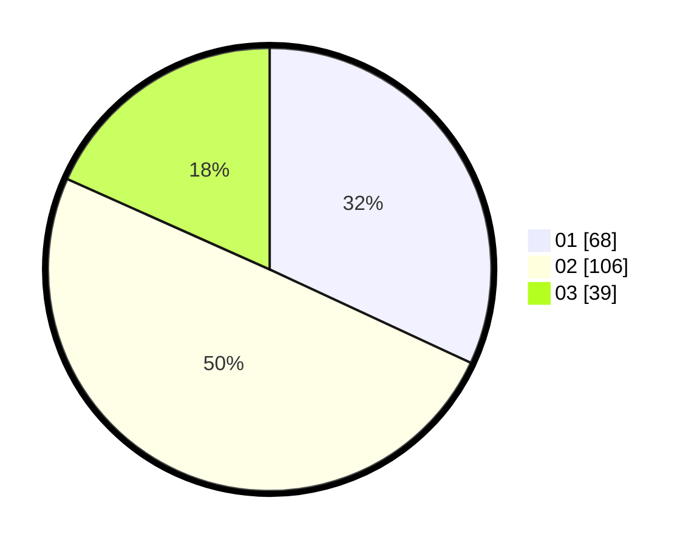

# Hasil

Hasil perolehan suara paslon dapat dilihat pada file paslon-01.txt, paslon-02.txt, dan paslon-03.txt.

Jika tidak ada, artinya data tersebut belum ada pada SIREKAP.

## Perolehan Suara

 * Paslon 01: **68**.
 * Paslon 02: **106**.
 * Paslon 03: **39**.

## Foto C Plano

https://sirekap-obj-formc.kpu.go.id/0cf6/pemilu/ppwp/31/75/03/10/06/3175031006089-20240216-175742--9be954e3-1bda-48d0-8672-94f30277c985.jpg

https://sirekap-obj-formc.kpu.go.id/0cf6/pemilu/ppwp/31/75/03/10/06/3175031006089-20240216-175743--0abd40ba-9317-4f1c-b427-0c01284c5504.jpg

https://sirekap-obj-formc.kpu.go.id/0cf6/pemilu/ppwp/31/75/03/10/06/3175031006089-20240216-175743--9f68be33-da13-49ed-bf63-5ffbfdc1e2e2.jpg

## DATA PEMILIH TETAP

Jumlah pemilih dalam DPT: **220**.
 * L: **109**.
 * P: **111**.

## DATA PENGGUNA HAK PILIH

Jumlah pengguna hak pilih dalam DPT: **220**.
 * L: **109**.
 * P: **111**.

Jumlah pengguna hak pilih dalam DPTb: **0**.
 * L: **0**.
 * P: **0**.

Jumlah pengguna hak pilih dalam DPK: **0**.
 * L: **0**.
 * P: **1**.

Jumlah pengguna hak pilih: **221**.
 * L: **109**.
 * P: **112**.

## JUMLAH SUARA SAH DAN TIDAK SAH

JUMLAH SELURUH SUARA SAH: **213**.

JUMLAH SUARA TIDAK SAH: **8**.

JUMLAH SELURUH SUARA SAH DAN SUARA TIDAK SAH: **221**.
