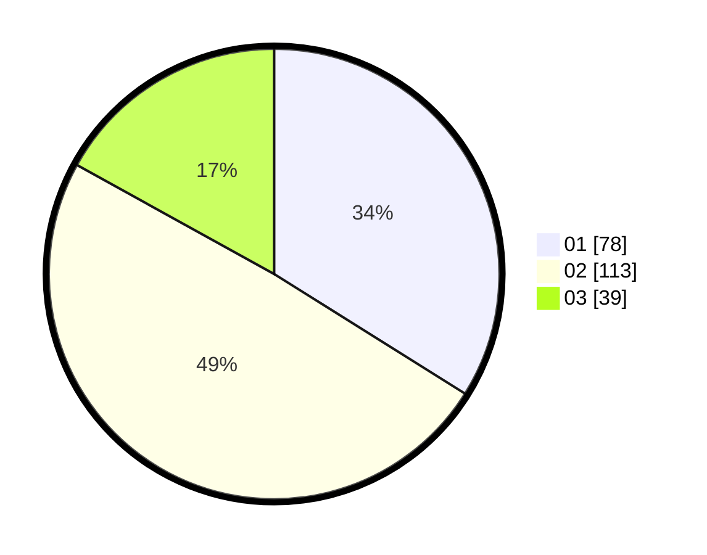

# Hasil

Hasil perolehan suara paslon dapat dilihat pada file paslon-01.txt, paslon-02.txt, dan paslon-03.txt.

Jika tidak ada, artinya data tersebut belum ada pada SIREKAP.

## Perolehan Suara

 * Paslon 01: **78**.
 * Paslon 02: **113**.
 * Paslon 03: **39**.

## Foto C Plano

https://sirekap-obj-formc.kpu.go.id/4c2b/pemilu/ppwp/31/75/03/10/06/3175031006090-20240214-191046--2b64ab7e-86e7-46c8-bd9d-614d6d4d0bea.jpg

https://sirekap-obj-formc.kpu.go.id/4c2b/pemilu/ppwp/31/75/03/10/06/3175031006090-20240214-191110--0c80ac27-bee0-4bca-bcd5-0d2e04c41a2c.jpg

https://sirekap-obj-formc.kpu.go.id/4c2b/pemilu/ppwp/31/75/03/10/06/3175031006090-20240214-195404--e4155bdc-59ea-4b33-a9be-85d5252d67ed.jpg

## DATA PEMILIH TETAP

Jumlah pemilih dalam DPT: **299**.
 * L: **142**.
 * P: **157**.

## DATA PENGGUNA HAK PILIH

Jumlah pengguna hak pilih dalam DPT: **231**.
 * L: **110**.
 * P: **121**.

Jumlah pengguna hak pilih dalam DPTb: **0**.
 * L: **0**.
 * P: **0**.

Jumlah pengguna hak pilih dalam DPK: **2**.
 * L: **0**.
 * P: **2**.

Jumlah pengguna hak pilih: **233**.
 * L: **110**.
 * P: **123**.

## JUMLAH SUARA SAH DAN TIDAK SAH

JUMLAH SELURUH SUARA SAH: **230**.

JUMLAH SUARA TIDAK SAH: **3**.

JUMLAH SELURUH SUARA SAH DAN SUARA TIDAK SAH: **233**.
