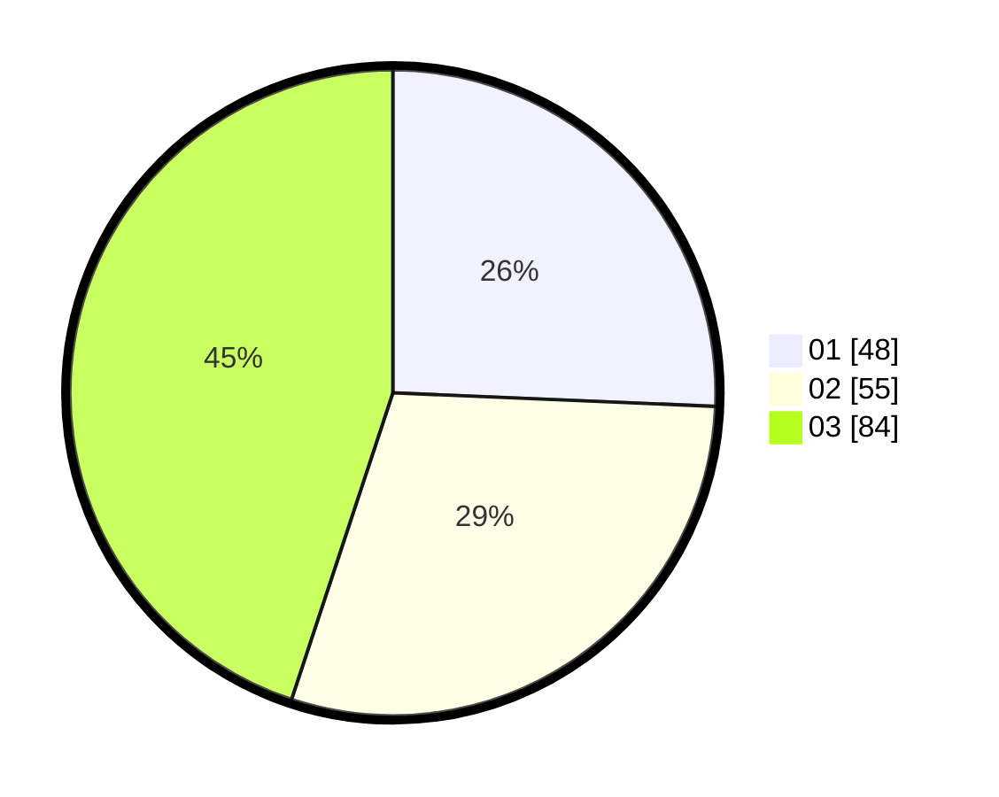

# Hasil

Hasil perolehan suara paslon dapat dilihat pada file paslon-01.txt, paslon-02.txt, dan paslon-03.txt.

Jika tidak ada, artinya data tersebut belum ada pada SIREKAP.

## Perolehan Suara

 * Paslon 01: **48**.
 * Paslon 02: **55**.
 * Paslon 03: **84**.

## Foto C Plano

https://sirekap-obj-formc.kpu.go.id/9f6d/pemilu/ppwp/31/75/03/10/06/3175031006091-20240215-141619--72babf69-711b-499f-bfc9-3d496fd75cbb.jpg

https://sirekap-obj-formc.kpu.go.id/9f6d/pemilu/ppwp/31/75/03/10/06/3175031006091-20240215-134443--1371f77f-b2ff-431c-a8c5-77f0656596e8.jpg

https://sirekap-obj-formc.kpu.go.id/9f6d/pemilu/ppwp/31/75/03/10/06/3175031006091-20240214-204113--de18c89c-07ca-46e7-9eba-a52b72c828ea.jpg

## DATA PEMILIH TETAP

Jumlah pemilih dalam DPT: **207**.
 * L: **83**.
 * P: **124**.

## DATA PENGGUNA HAK PILIH

Jumlah pengguna hak pilih dalam DPT: **177**.
 * L: **70**.
 * P: **107**.

Jumlah pengguna hak pilih dalam DPTb: **11**.
 * L: **5**.
 * P: **6**.

Jumlah pengguna hak pilih dalam DPK: **0**.
 * L: **0**.
 * P: **0**.

Jumlah pengguna hak pilih: **188**.
 * L: **75**.
 * P: **113**.

## JUMLAH SUARA SAH DAN TIDAK SAH

JUMLAH SELURUH SUARA SAH: **187**.

JUMLAH SUARA TIDAK SAH: **1**.

JUMLAH SELURUH SUARA SAH DAN SUARA TIDAK SAH: **188**.
