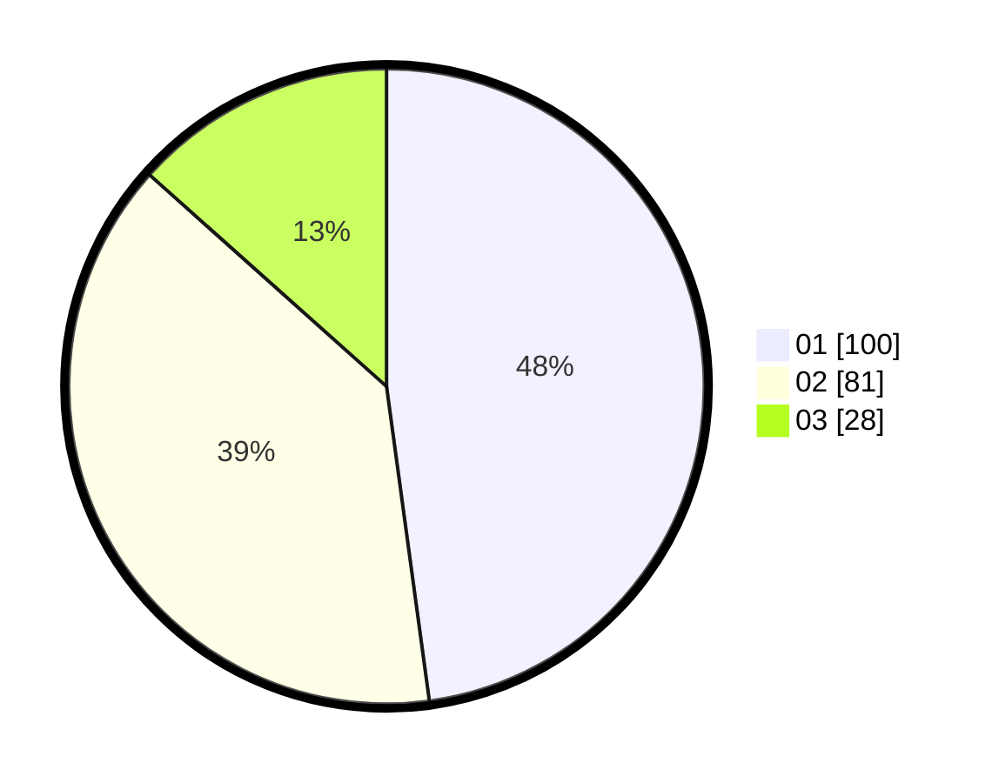

# Hasil

Hasil perolehan suara paslon dapat dilihat pada file paslon-01.txt, paslon-02.txt, dan paslon-03.txt.

Jika tidak ada, artinya data tersebut belum ada pada SIREKAP.

## Perolehan Suara

 * Paslon 01: **100**.
 * Paslon 02: **81**.
 * Paslon 03: **28**.

## Foto C Plano

https://sirekap-obj-formc.kpu.go.id/fa0a/pemilu/ppwp/31/75/03/10/06/3175031006097-20240214-223406--5bbec6bc-6ab3-4ebb-9a94-190397d8cb9b.jpg

https://sirekap-obj-formc.kpu.go.id/fa0a/pemilu/ppwp/31/75/03/10/06/3175031006097-20240214-223626--92d48fc3-9301-43db-b16f-8da5803e71e0.jpg
