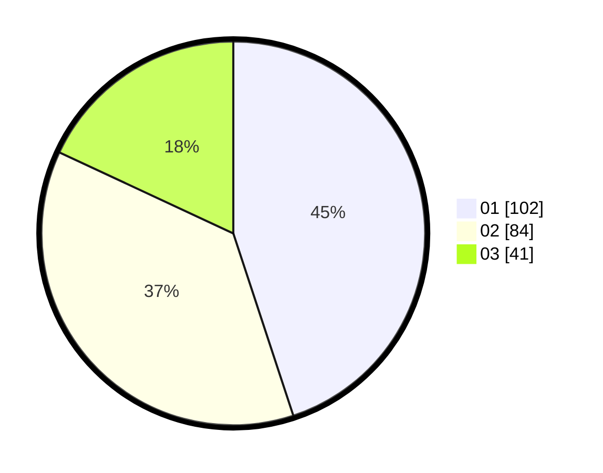

# Hasil

Hasil perolehan suara paslon dapat dilihat pada file paslon-01.txt, paslon-02.txt, dan paslon-03.txt.

Jika tidak ada, artinya data tersebut belum ada pada SIREKAP.

## Perolehan Suara

 * Paslon 01: **102**.
 * Paslon 02: **84**.
 * Paslon 03: **41**.

## Foto C Plano

https://sirekap-obj-formc.kpu.go.id/3924/pemilu/ppwp/31/75/03/10/06/3175031006108-20240216-022926--f91c005e-e08b-4735-b3fc-2173bc27a033.jpg

https://sirekap-obj-formc.kpu.go.id/3924/pemilu/ppwp/31/75/03/10/06/3175031006108-20240216-022927--51b526d4-2bbf-41ea-aa96-6b140e8f87a3.jpg

https://sirekap-obj-formc.kpu.go.id/3924/pemilu/ppwp/31/75/03/10/06/3175031006108-20240216-022926--7d7cfa61-23a7-4d46-b41e-fc2846e476e1.jpg

## DATA PEMILIH TETAP

Jumlah pemilih dalam DPT: **291**.
 * L: **140**.
 * P: **151**.

## DATA PENGGUNA HAK PILIH

Jumlah pengguna hak pilih dalam DPT: **224**.
 * L: **102**.
 * P: **122**.

Jumlah pengguna hak pilih dalam DPTb: **1**.
 * L: **1**.
 * P: **0**.

Jumlah pengguna hak pilih dalam DPK: **3**.
 * L: **1**.
 * P: **2**.

Jumlah pengguna hak pilih: **228**.
 * L: **104**.
 * P: **124**.

## JUMLAH SUARA SAH DAN TIDAK SAH

JUMLAH SELURUH SUARA SAH: **227**.

JUMLAH SUARA TIDAK SAH: **1**.

JUMLAH SELURUH SUARA SAH DAN SUARA TIDAK SAH: **228**.
