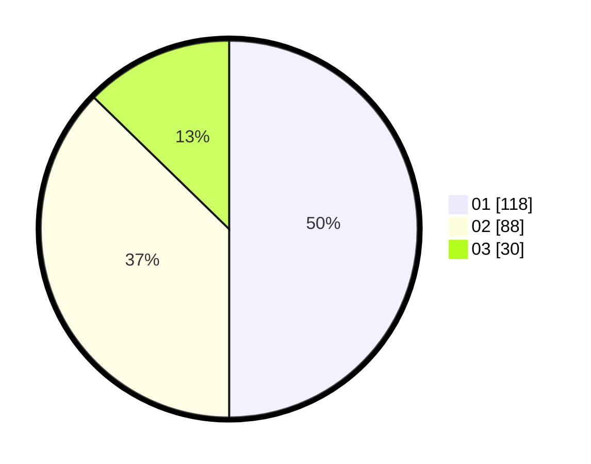

# Hasil

Hasil perolehan suara paslon dapat dilihat pada file paslon-01.txt, paslon-02.txt, dan paslon-03.txt.

Jika tidak ada, artinya data tersebut belum ada pada SIREKAP.

## Perolehan Suara

 * Paslon 01: **118**.
 * Paslon 02: **88**.
 * Paslon 03: **30**.

## Foto C Plano

https://sirekap-obj-formc.kpu.go.id/15c7/pemilu/ppwp/31/75/03/10/06/3175031006112-20240215-033730--fdf805de-cbd0-45d4-94ad-45c5f15c0bd8.jpg

https://sirekap-obj-formc.kpu.go.id/15c7/pemilu/ppwp/31/75/03/10/06/3175031006112-20240214-221039--2112e9d6-e548-409d-ac75-fc6bd7276b6f.jpg

https://sirekap-obj-formc.kpu.go.id/15c7/pemilu/ppwp/31/75/03/10/06/3175031006112-20240214-222022--5335ae31-c5e0-47f9-a070-4348c418bc10.jpg
