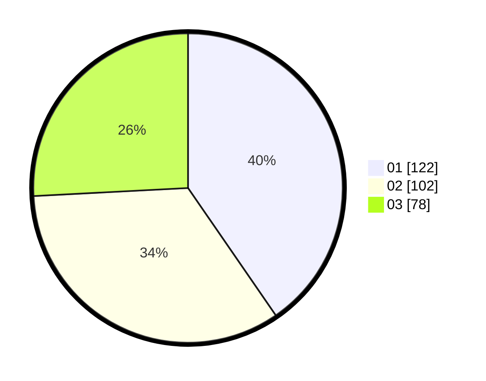

# Hasil

Hasil perolehan suara paslon dapat dilihat pada file paslon-01.txt, paslon-02.txt, dan paslon-03.txt.

Jika tidak ada, artinya data tersebut belum ada pada SIREKAP.

## Perolehan Suara

 * Paslon 01: **122**.
 * Paslon 02: **102**.
 * Paslon 03: **78**.

## Foto C Plano

https://sirekap-obj-formc.kpu.go.id/9834/pemilu/ppwp/31/75/03/10/06/3175031006113-20240214-211131--f8cb0aa8-a0b0-489d-a5da-b838a3ec7da9.jpg

https://sirekap-obj-formc.kpu.go.id/9834/pemilu/ppwp/31/75/03/10/06/3175031006113-20240214-211455--404d62b3-76e0-4ce3-af92-e12d07371987.jpg
