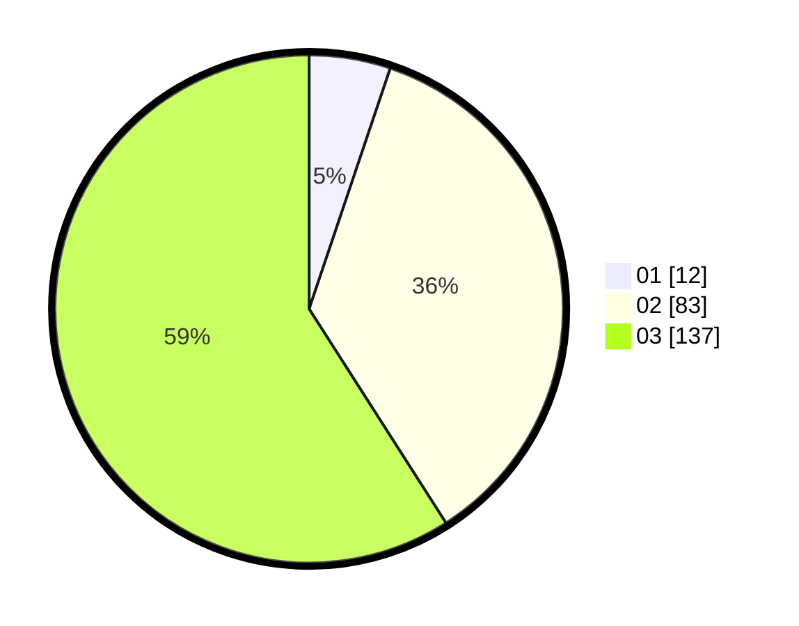

# Hasil

Hasil perolehan suara paslon dapat dilihat pada file paslon-01.txt, paslon-02.txt, dan paslon-03.txt.

Jika tidak ada, artinya data tersebut belum ada pada SIREKAP.

## Perolehan Suara

 * Paslon 01: **12**.
 * Paslon 02: **83**.
 * Paslon 03: **137**.

## Foto C Plano

https://sirekap-obj-formc.kpu.go.id/6338/pemilu/ppwp/31/75/03/10/06/3175031006122-20240214-215424--6fc5babb-d31d-4a94-bbaa-ef9c27965343.jpg

https://sirekap-obj-formc.kpu.go.id/6338/pemilu/ppwp/31/75/03/10/06/3175031006122-20240216-132416--4cb44b30-6a4d-47c7-9b13-237a1225a54f.jpg

https://sirekap-obj-formc.kpu.go.id/6338/pemilu/ppwp/31/75/03/10/06/3175031006122-20240214-212827--74ecebf8-553e-4b87-adac-de84da49a2e0.jpg

## DATA PEMILIH TETAP

Jumlah pemilih dalam DPT: **287**.
 * L: **122**.
 * P: **165**.

## DATA PENGGUNA HAK PILIH

Jumlah pengguna hak pilih dalam DPT: **222**.
 * L: **96**.
 * P: **126**.

Jumlah pengguna hak pilih dalam DPTb: **6**.
 * L: **1**.
 * P: **5**.

Jumlah pengguna hak pilih dalam DPK: **6**.
 * L: **3**.
 * P: **3**.

Jumlah pengguna hak pilih: **234**.
 * L: **100**.
 * P: **134**.

## JUMLAH SUARA SAH DAN TIDAK SAH

JUMLAH SELURUH SUARA SAH: **232**.

JUMLAH SUARA TIDAK SAH: **1**.

JUMLAH SELURUH SUARA SAH DAN SUARA TIDAK SAH: **233**.
