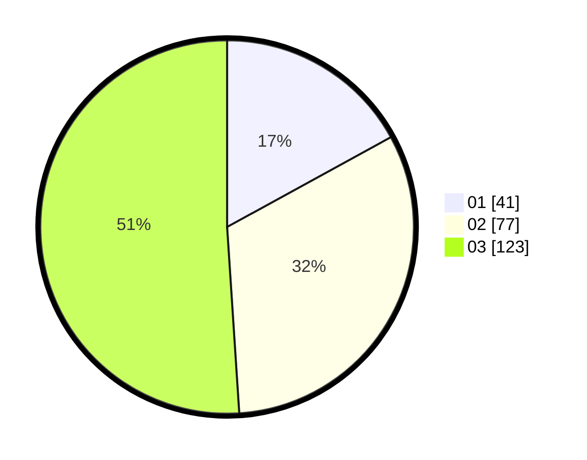

# Hasil

Hasil perolehan suara paslon dapat dilihat pada file paslon-01.txt, paslon-02.txt, dan paslon-03.txt.

Jika tidak ada, artinya data tersebut belum ada pada SIREKAP.

## Perolehan Suara

 * Paslon 01: **41**.
 * Paslon 02: **77**.
 * Paslon 03: **123**.

## Foto C Plano

https://sirekap-obj-formc.kpu.go.id/8a78/pemilu/ppwp/31/75/03/10/06/3175031006124-20240214-212203--e44982b4-25fb-4491-a1db-228dd2d9371b.jpg

https://sirekap-obj-formc.kpu.go.id/8a78/pemilu/ppwp/31/75/03/10/06/3175031006124-20240215-010441--99ba0048-ee38-4a9d-8427-01ec40b2ecff.jpg

https://sirekap-obj-formc.kpu.go.id/8a78/pemilu/ppwp/31/75/03/10/06/3175031006124-20240214-210811--28d4ec53-8ce9-45be-b465-2e6f44dd31bb.jpg
