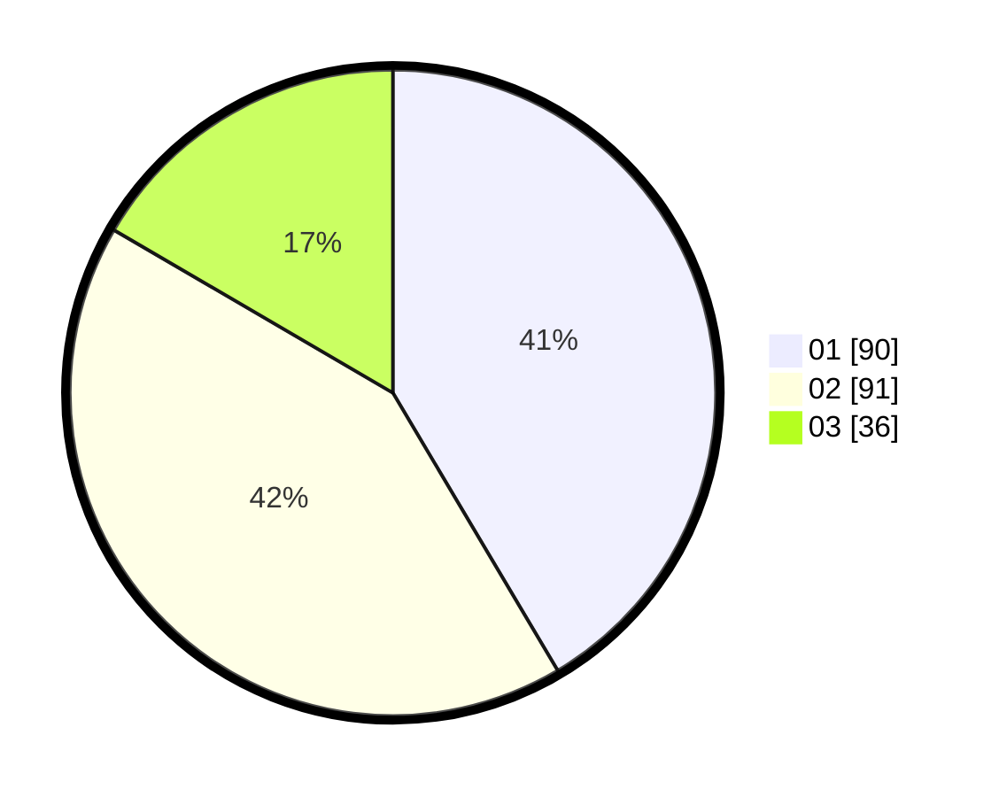

# Hasil

Hasil perolehan suara paslon dapat dilihat pada file paslon-01.txt, paslon-02.txt, dan paslon-03.txt.

Jika tidak ada, artinya data tersebut belum ada pada SIREKAP.

## Perolehan Suara

 * Paslon 01: **90**.
 * Paslon 02: **91**.
 * Paslon 03: **36**.

## Foto C Plano

https://sirekap-obj-formc.kpu.go.id/ced6/pemilu/ppwp/31/75/03/10/06/3175031006131-20240216-073043--4cef8666-28cb-4b74-a211-a927ffa06b10.jpg

https://sirekap-obj-formc.kpu.go.id/ced6/pemilu/ppwp/31/75/03/10/06/3175031006131-20240216-073044--ddb0f49c-0a21-45de-a45c-15e80d0114a0.jpg

https://sirekap-obj-formc.kpu.go.id/ced6/pemilu/ppwp/31/75/03/10/06/3175031006131-20240216-073043--86dc9a08-ffb6-474e-b63b-bddefe91a1fc.jpg

## DATA PEMILIH TETAP

Jumlah pemilih dalam DPT: **0**.
 * L: **0**.
 * P: **0**.

## DATA PENGGUNA HAK PILIH

Jumlah pengguna hak pilih dalam DPT: **0**.
 * L: **0**.
 * P: **0**.

Jumlah pengguna hak pilih dalam DPTb: **0**.
 * L: **0**.
 * P: **0**.

Jumlah pengguna hak pilih dalam DPK: **0**.
 * L: **0**.
 * P: **0**.

Jumlah pengguna hak pilih: **0**.
 * L: **0**.
 * P: **0**.

## JUMLAH SUARA SAH DAN TIDAK SAH

JUMLAH SELURUH SUARA SAH: **217**.

JUMLAH SUARA TIDAK SAH: **4**.

JUMLAH SELURUH SUARA SAH DAN SUARA TIDAK SAH: **221**.
