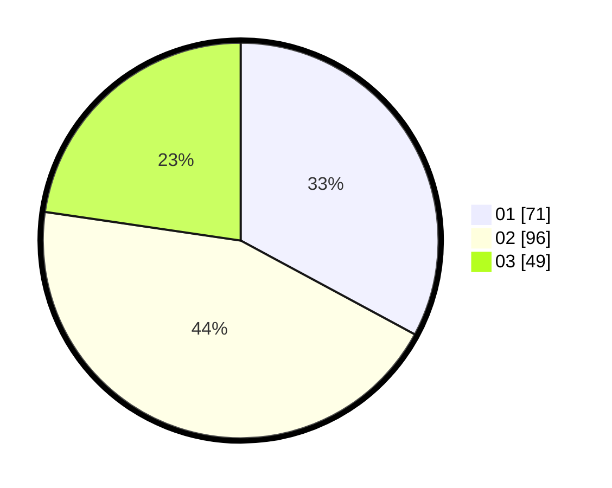

# Hasil

Hasil perolehan suara paslon dapat dilihat pada file paslon-01.txt, paslon-02.txt, dan paslon-03.txt.

Jika tidak ada, artinya data tersebut belum ada pada SIREKAP.

## Perolehan Suara

 * Paslon 01: **71**.
 * Paslon 02: **96**.
 * Paslon 03: **49**.

## Foto C Plano

https://sirekap-obj-formc.kpu.go.id/c4db/pemilu/ppwp/31/75/03/10/06/3175031006133-20240215-102545--75069783-53d9-4a65-a1af-60abd9cb3003.jpg

https://sirekap-obj-formc.kpu.go.id/c4db/pemilu/ppwp/31/75/03/10/06/3175031006133-20240215-102614--d4e992e9-629e-4232-9b8d-18cbb2fd0c40.jpg

https://sirekap-obj-formc.kpu.go.id/c4db/pemilu/ppwp/31/75/03/10/06/3175031006133-20240215-102603--5dd829c3-a2ee-4edb-8517-e2bd1d0ec543.jpg

## DATA PEMILIH TETAP

Jumlah pemilih dalam DPT: **262**.
 * L: **127**.
 * P: **135**.

## DATA PENGGUNA HAK PILIH

Jumlah pengguna hak pilih dalam DPT: **213**.
 * L: **100**.
 * P: **113**.

Jumlah pengguna hak pilih dalam DPTb: **6**.
 * L: **2**.
 * P: **4**.

Jumlah pengguna hak pilih dalam DPK: **1**.
 * L: **1**.
 * P: **0**.

Jumlah pengguna hak pilih: **220**.
 * L: **103**.
 * P: **117**.

## JUMLAH SUARA SAH DAN TIDAK SAH

JUMLAH SELURUH SUARA SAH: **216**.

JUMLAH SUARA TIDAK SAH: **4**.

JUMLAH SELURUH SUARA SAH DAN SUARA TIDAK SAH: **220**.
