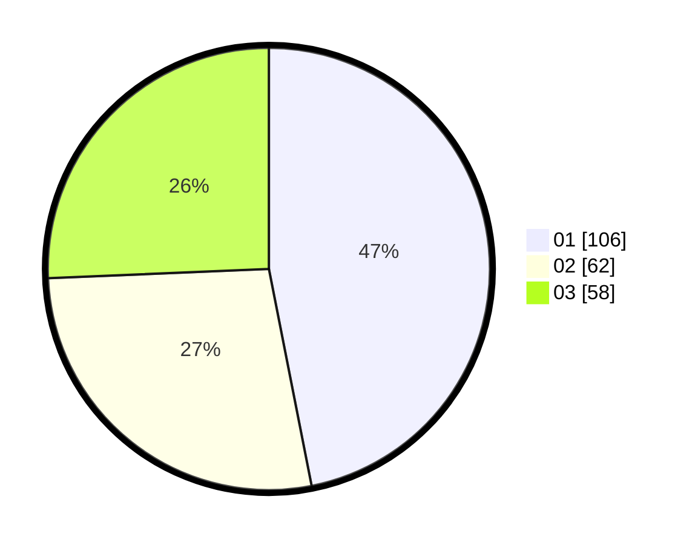

# Hasil

Hasil perolehan suara paslon dapat dilihat pada file paslon-01.txt, paslon-02.txt, dan paslon-03.txt.

Jika tidak ada, artinya data tersebut belum ada pada SIREKAP.

## Perolehan Suara

 * Paslon 01: **106**.
 * Paslon 02: **62**.
 * Paslon 03: **58**.

## Foto C Plano

https://sirekap-obj-formc.kpu.go.id/3584/pemilu/ppwp/31/75/03/10/06/3175031006139-20240214-185038--9d858c57-16a9-44f4-9530-9e7c37a190b1.jpg

https://sirekap-obj-formc.kpu.go.id/3584/pemilu/ppwp/31/75/03/10/06/3175031006139-20240214-185054--24a4d8b4-436f-4373-8312-b169b126b3c2.jpg
