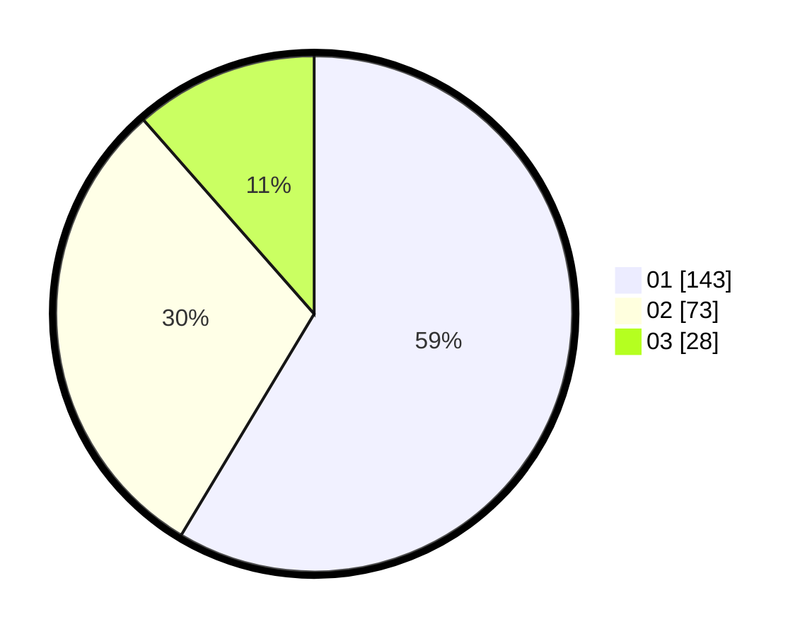

# Hasil

Hasil perolehan suara paslon dapat dilihat pada file paslon-01.txt, paslon-02.txt, dan paslon-03.txt.

Jika tidak ada, artinya data tersebut belum ada pada SIREKAP.

## Perolehan Suara

 * Paslon 01: **143**.
 * Paslon 02: **73**.
 * Paslon 03: **28**.

## Foto C Plano

https://sirekap-obj-formc.kpu.go.id/cbb5/pemilu/ppwp/31/75/03/10/06/3175031006143-20240214-213748--ccdab9fa-c41e-4234-aae1-c994a445e18c.jpg

https://sirekap-obj-formc.kpu.go.id/cbb5/pemilu/ppwp/31/75/03/10/06/3175031006143-20240214-213520--be3cc829-ad57-4482-b1c9-5c58e08b87c9.jpg

https://sirekap-obj-formc.kpu.go.id/cbb5/pemilu/ppwp/31/75/03/10/06/3175031006143-20240214-213644--d7a1d5f7-3577-4d61-bd68-9b504e5fe8cc.jpg

## DATA PEMILIH TETAP

Jumlah pemilih dalam DPT: **297**.
 * L: **146**.
 * P: **151**.

## DATA PENGGUNA HAK PILIH

Jumlah pengguna hak pilih dalam DPT: **239**.
 * L: **118**.
 * P: **121**.

Jumlah pengguna hak pilih dalam DPTb: **5**.
 * L: **1**.
 * P: **4**.

Jumlah pengguna hak pilih dalam DPK: **4**.
 * L: **2**.
 * P: **2**.

Jumlah pengguna hak pilih: **248**.
 * L: **121**.
 * P: **127**.

## JUMLAH SUARA SAH DAN TIDAK SAH

JUMLAH SELURUH SUARA SAH: **244**.

JUMLAH SUARA TIDAK SAH: **4**.

JUMLAH SELURUH SUARA SAH DAN SUARA TIDAK SAH: **248**.
