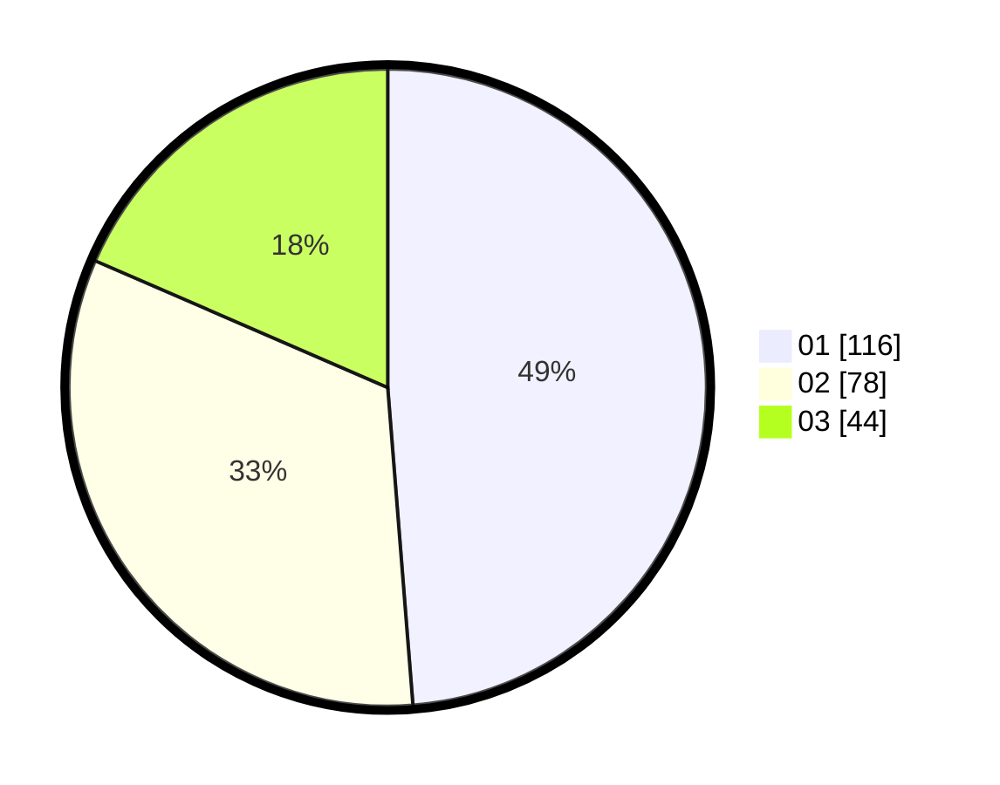

# Hasil

Hasil perolehan suara paslon dapat dilihat pada file paslon-01.txt, paslon-02.txt, dan paslon-03.txt.

Jika tidak ada, artinya data tersebut belum ada pada SIREKAP.

## Perolehan Suara

 * Paslon 01: **116**.
 * Paslon 02: **78**.
 * Paslon 03: **44**.

## Foto C Plano

https://sirekap-obj-formc.kpu.go.id/69f4/pemilu/ppwp/31/75/03/10/06/3175031006146-20240214-195307--525770fd-4717-49e8-bf18-bd9a40bf0aaf.jpg

https://sirekap-obj-formc.kpu.go.id/69f4/pemilu/ppwp/31/75/03/10/06/3175031006146-20240214-195406--842e3ac1-3be4-4873-a468-024060a985ae.jpg

https://sirekap-obj-formc.kpu.go.id/69f4/pemilu/ppwp/31/75/03/10/06/3175031006146-20240214-224821--8dff5379-cd02-4a61-be3f-e0dba64031c2.jpg

## DATA PEMILIH TETAP

Jumlah pemilih dalam DPT: **290**.
 * L: **133**.
 * P: **157**.

## DATA PENGGUNA HAK PILIH

Jumlah pengguna hak pilih dalam DPT: **239**.
 * L: **110**.
 * P: **129**.

Jumlah pengguna hak pilih dalam DPTb: **2**.
 * L: **0**.
 * P: **2**.

Jumlah pengguna hak pilih dalam DPK: **1**.
 * L: **1**.
 * P: **0**.

Jumlah pengguna hak pilih: **242**.
 * L: **111**.
 * P: **131**.

## JUMLAH SUARA SAH DAN TIDAK SAH

JUMLAH SELURUH SUARA SAH: **238**.

JUMLAH SUARA TIDAK SAH: **4**.

JUMLAH SELURUH SUARA SAH DAN SUARA TIDAK SAH: **242**.
