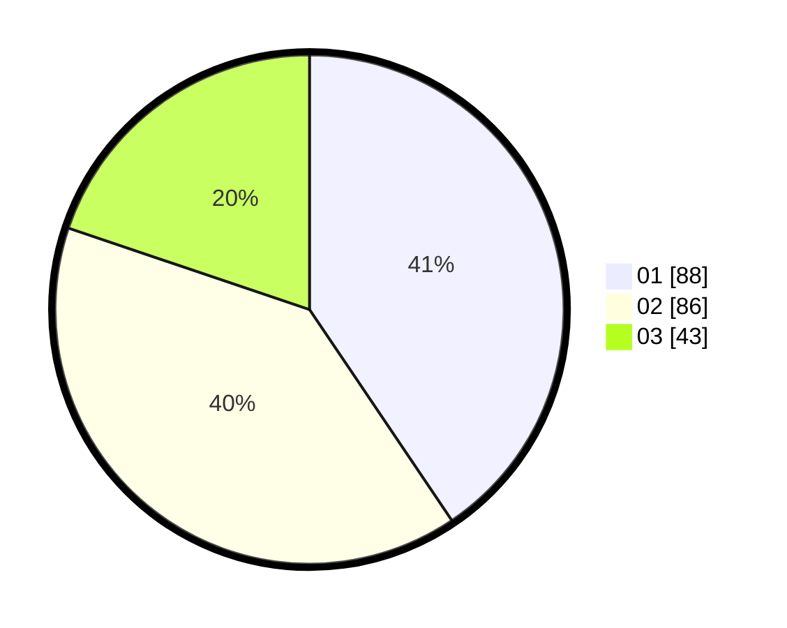

# Hasil

Hasil perolehan suara paslon dapat dilihat pada file paslon-01.txt, paslon-02.txt, dan paslon-03.txt.

Jika tidak ada, artinya data tersebut belum ada pada SIREKAP.

## Perolehan Suara

 * Paslon 01: **88**.
 * Paslon 02: **86**.
 * Paslon 03: **43**.

## Foto C Plano

https://sirekap-obj-formc.kpu.go.id/2401/pemilu/ppwp/31/75/03/10/06/3175031006148-20240214-205103--09a4528a-6e34-446f-8d4f-58fc8047d85e.jpg

https://sirekap-obj-formc.kpu.go.id/2401/pemilu/ppwp/31/75/03/10/06/3175031006148-20240214-205344--a9f1443a-5dff-44cb-8724-4b12d195331b.jpg

https://sirekap-obj-formc.kpu.go.id/2401/pemilu/ppwp/31/75/03/10/06/3175031006148-20240215-223308--3672318b-7e94-4962-8521-42491dff38ce.jpg

## DATA PEMILIH TETAP

Jumlah pemilih dalam DPT: **286**.
 * L: **131**.
 * P: **155**.

## DATA PENGGUNA HAK PILIH

Jumlah pengguna hak pilih dalam DPT: **216**.
 * L: **100**.
 * P: **116**.

Jumlah pengguna hak pilih dalam DPTb: **0**.
 * L: **0**.
 * P: **0**.

Jumlah pengguna hak pilih dalam DPK: **3**.
 * L: **1**.
 * P: **2**.

Jumlah pengguna hak pilih: **219**.
 * L: **101**.
 * P: **118**.

## JUMLAH SUARA SAH DAN TIDAK SAH

JUMLAH SELURUH SUARA SAH: **217**.

JUMLAH SUARA TIDAK SAH: **2**.

JUMLAH SELURUH SUARA SAH DAN SUARA TIDAK SAH: **219**.
