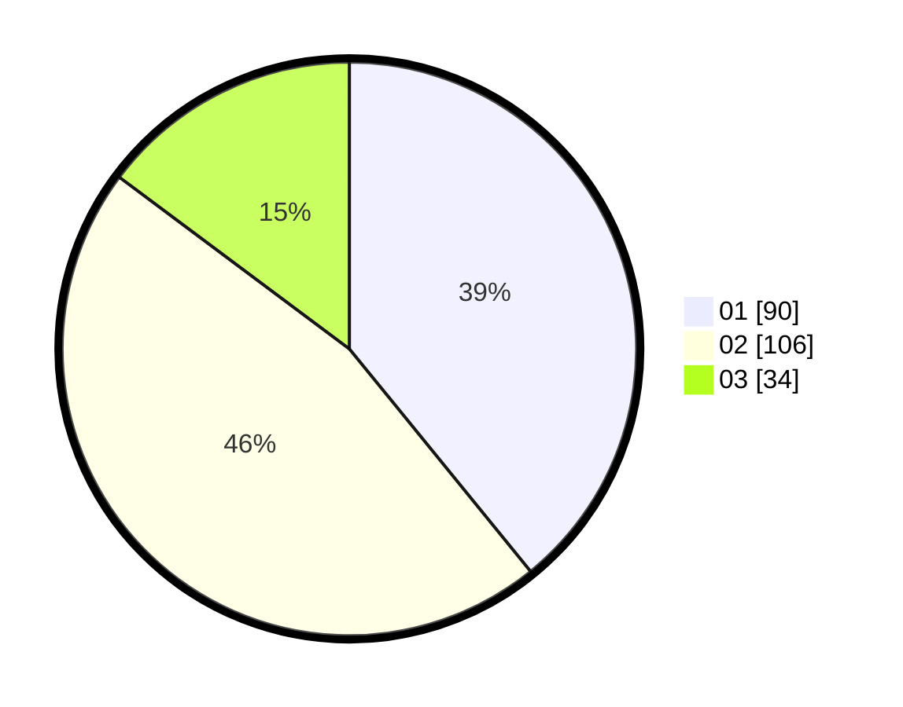

# Hasil

Hasil perolehan suara paslon dapat dilihat pada file paslon-01.txt, paslon-02.txt, dan paslon-03.txt.

Jika tidak ada, artinya data tersebut belum ada pada SIREKAP.

## Perolehan Suara

 * Paslon 01: **90**.
 * Paslon 02: **106**.
 * Paslon 03: **34**.

## Foto C Plano

https://sirekap-obj-formc.kpu.go.id/cf83/pemilu/ppwp/31/75/03/10/06/3175031006151-20240214-204625--3840981a-bfdf-490e-a626-4971c1f028d9.jpg

https://sirekap-obj-formc.kpu.go.id/cf83/pemilu/ppwp/31/75/03/10/06/3175031006151-20240214-204647--35e00cc8-7895-479d-b299-aaf2c7cd9e93.jpg

https://sirekap-obj-formc.kpu.go.id/cf83/pemilu/ppwp/31/75/03/10/06/3175031006151-20240214-204636--0facdde2-8737-4ee1-8ca0-b53a9d0a900a.jpg

## DATA PEMILIH TETAP

Jumlah pemilih dalam DPT: **278**.
 * L: **149**.
 * P: **129**.

## DATA PENGGUNA HAK PILIH

Jumlah pengguna hak pilih dalam DPT: **236**.
 * L: **125**.
 * P: **111**.

Jumlah pengguna hak pilih dalam DPTb: **0**.
 * L: **0**.
 * P: **0**.

Jumlah pengguna hak pilih dalam DPK: **0**.
 * L: **0**.
 * P: **0**.

Jumlah pengguna hak pilih: **236**.
 * L: **125**.
 * P: **111**.

## JUMLAH SUARA SAH DAN TIDAK SAH

JUMLAH SELURUH SUARA SAH: **230**.

JUMLAH SUARA TIDAK SAH: **6**.

JUMLAH SELURUH SUARA SAH DAN SUARA TIDAK SAH: **236**.
