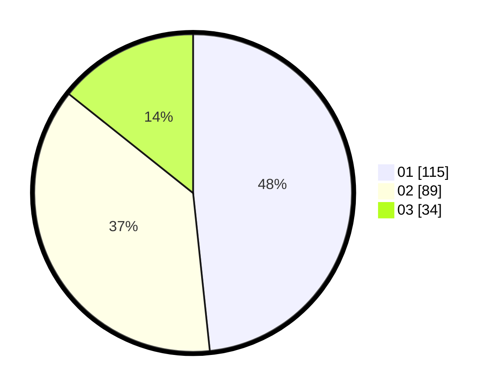

# Hasil

Hasil perolehan suara paslon dapat dilihat pada file paslon-01.txt, paslon-02.txt, dan paslon-03.txt.

Jika tidak ada, artinya data tersebut belum ada pada SIREKAP.

## Perolehan Suara

 * Paslon 01: **115**.
 * Paslon 02: **89**.
 * Paslon 03: **34**.

## Foto C Plano

https://sirekap-obj-formc.kpu.go.id/6a69/pemilu/ppwp/31/75/03/10/06/3175031006153-20240214-200654--760dd8b9-7bb7-4728-a070-333b856a855d.jpg

https://sirekap-obj-formc.kpu.go.id/6a69/pemilu/ppwp/31/75/03/10/06/3175031006153-20240214-203256--76e163b2-e8c4-4c41-91fd-7de5ec169269.jpg

https://sirekap-obj-formc.kpu.go.id/6a69/pemilu/ppwp/31/75/03/10/06/3175031006153-20240214-200151--ec523102-b11a-4ab4-9cbb-de7a50b316b4.jpg

## DATA PEMILIH TETAP

Jumlah pemilih dalam DPT: **290**.
 * L: **132**.
 * P: **158**.

## DATA PENGGUNA HAK PILIH

Jumlah pengguna hak pilih dalam DPT: **238**.
 * L: **115**.
 * P: **123**.

Jumlah pengguna hak pilih dalam DPTb: **1**.
 * L: **1**.
 * P: **0**.

Jumlah pengguna hak pilih dalam DPK: **1**.
 * L: **0**.
 * P: **1**.

Jumlah pengguna hak pilih: **240**.
 * L: **116**.
 * P: **124**.

## JUMLAH SUARA SAH DAN TIDAK SAH

JUMLAH SELURUH SUARA SAH: **238**.

JUMLAH SUARA TIDAK SAH: **2**.

JUMLAH SELURUH SUARA SAH DAN SUARA TIDAK SAH: **240**.
