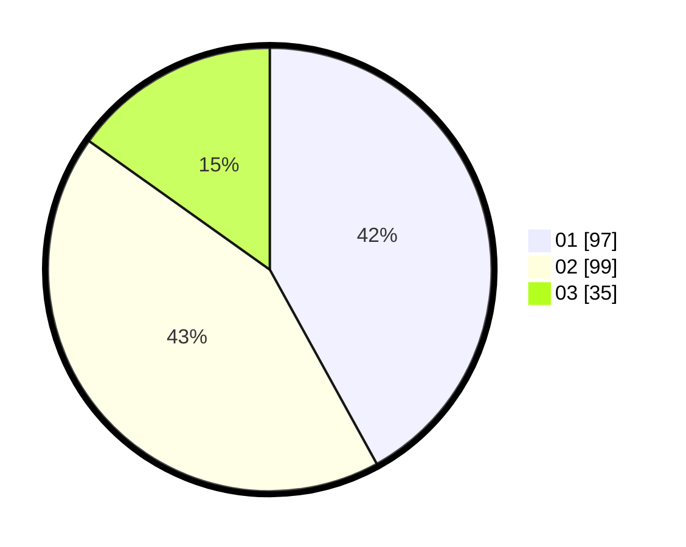

# Hasil

Hasil perolehan suara paslon dapat dilihat pada file paslon-01.txt, paslon-02.txt, dan paslon-03.txt.

Jika tidak ada, artinya data tersebut belum ada pada SIREKAP.

## Perolehan Suara

 * Paslon 01: **97**.
 * Paslon 02: **99**.
 * Paslon 03: **35**.

## Foto C Plano

https://sirekap-obj-formc.kpu.go.id/c80e/pemilu/ppwp/31/75/03/10/06/3175031006154-20240215-031420--8fa3d064-4de9-4763-843c-dee95a7b4974.jpg

https://sirekap-obj-formc.kpu.go.id/c80e/pemilu/ppwp/31/75/03/10/06/3175031006154-20240214-194254--e45f1f5c-b921-49af-870f-d5bdb5ccb040.jpg

https://sirekap-obj-formc.kpu.go.id/c80e/pemilu/ppwp/31/75/03/10/06/3175031006154-20240214-194330--472f3ae0-44ee-48ec-82de-64be281c647d.jpg
