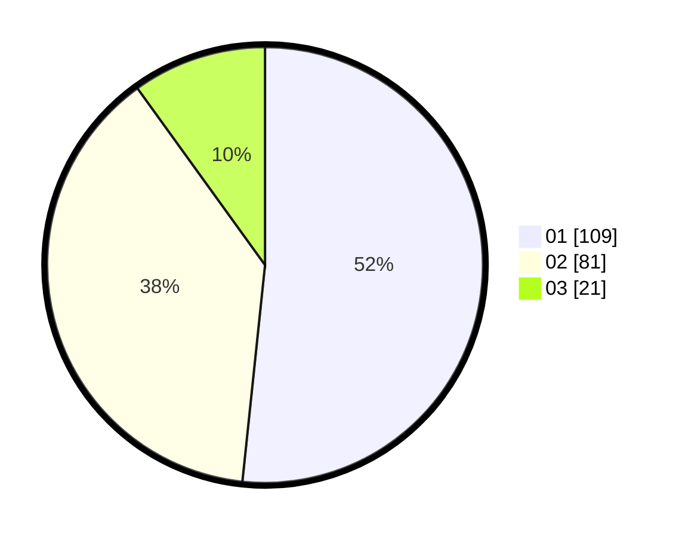

# Hasil

Hasil perolehan suara paslon dapat dilihat pada file paslon-01.txt, paslon-02.txt, dan paslon-03.txt.

Jika tidak ada, artinya data tersebut belum ada pada SIREKAP.

## Perolehan Suara

 * Paslon 01: **109**.
 * Paslon 02: **81**.
 * Paslon 03: **21**.

## Foto C Plano

https://sirekap-obj-formc.kpu.go.id/ae64/pemilu/ppwp/31/75/03/10/06/3175031006156-20240216-192534--5f0f9fb2-19c6-4120-8e45-f6992923c039.jpg

https://sirekap-obj-formc.kpu.go.id/ae64/pemilu/ppwp/31/75/03/10/06/3175031006156-20240216-192322--4156c7ef-9194-4a20-9563-b2757ecffff3.jpg

https://sirekap-obj-formc.kpu.go.id/ae64/pemilu/ppwp/31/75/03/10/06/3175031006156-20240214-233117--6ed00f73-72ef-45cf-9eab-b0d7c1c7859c.jpg
