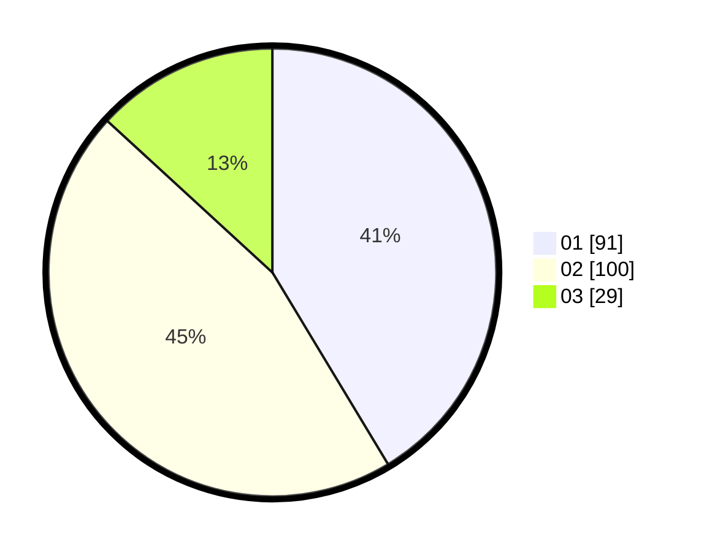

# Hasil

Hasil perolehan suara paslon dapat dilihat pada file paslon-01.txt, paslon-02.txt, dan paslon-03.txt.

Jika tidak ada, artinya data tersebut belum ada pada SIREKAP.

## Perolehan Suara

 * Paslon 01: **91**.
 * Paslon 02: **100**.
 * Paslon 03: **29**.

## Foto C Plano

https://sirekap-obj-formc.kpu.go.id/973f/pemilu/ppwp/31/75/03/10/06/3175031006157-20240214-223008--629ca44f-4f8e-4e8d-a500-31495e9a4809.jpg

https://sirekap-obj-formc.kpu.go.id/973f/pemilu/ppwp/31/75/03/10/06/3175031006157-20240214-223650--bbd0dfab-d1bc-4871-90ac-02663cc7d9ec.jpg

https://sirekap-obj-formc.kpu.go.id/973f/pemilu/ppwp/31/75/03/10/06/3175031006157-20240214-223929--67c4b76f-c70b-4f05-abcb-a08b1ba5a51d.jpg
