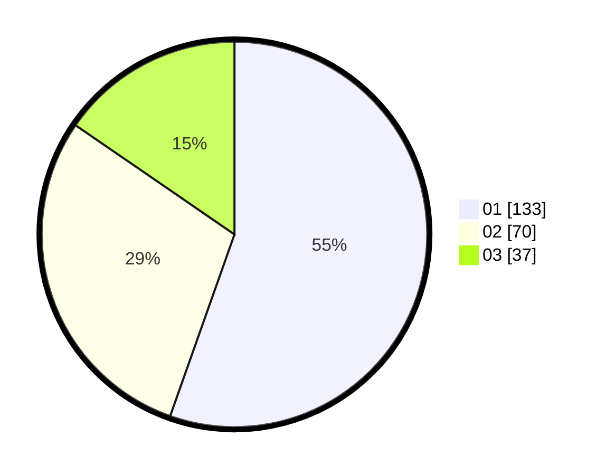

# Hasil

Hasil perolehan suara paslon dapat dilihat pada file paslon-01.txt, paslon-02.txt, dan paslon-03.txt.

Jika tidak ada, artinya data tersebut belum ada pada SIREKAP.

## Perolehan Suara

 * Paslon 01: **133**.
 * Paslon 02: **70**.
 * Paslon 03: **37**.

## Foto C Plano

https://sirekap-obj-formc.kpu.go.id/1335/pemilu/ppwp/31/75/03/10/06/3175031006162-20240214-155740--49c76aaf-4f21-497e-9392-02e2c0143a3f.jpg

https://sirekap-obj-formc.kpu.go.id/1335/pemilu/ppwp/31/75/03/10/06/3175031006162-20240214-155600--82e8b6d7-2b34-4067-9734-851f2b106519.jpg

https://sirekap-obj-formc.kpu.go.id/1335/pemilu/ppwp/31/75/03/10/06/3175031006162-20240214-155718--f139f5c1-2936-4500-b010-3d81e8a67b45.jpg

## DATA PEMILIH TETAP

Jumlah pemilih dalam DPT: **283**.
 * L: **142**.
 * P: **141**.

## DATA PENGGUNA HAK PILIH

Jumlah pengguna hak pilih dalam DPT: **235**.
 * L: **115**.
 * P: **120**.

Jumlah pengguna hak pilih dalam DPTb: **4**.
 * L: **2**.
 * P: **2**.

Jumlah pengguna hak pilih dalam DPK: **3**.
 * L: **1**.
 * P: **2**.

Jumlah pengguna hak pilih: **242**.
 * L: **118**.
 * P: **124**.

## JUMLAH SUARA SAH DAN TIDAK SAH

JUMLAH SELURUH SUARA SAH: **240**.

JUMLAH SUARA TIDAK SAH: **2**.

JUMLAH SELURUH SUARA SAH DAN SUARA TIDAK SAH: **242**.
