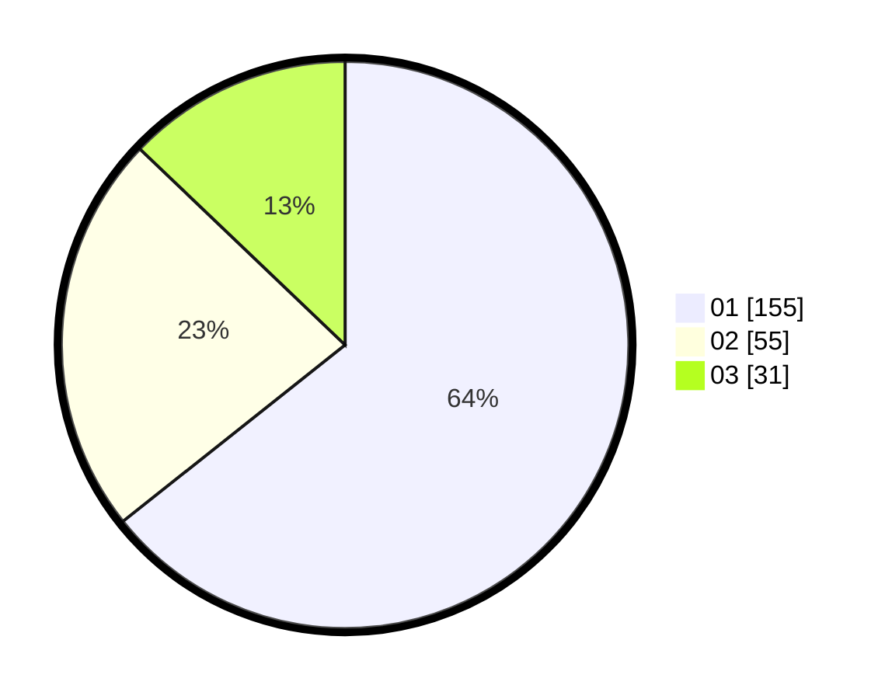

# Hasil

Hasil perolehan suara paslon dapat dilihat pada file paslon-01.txt, paslon-02.txt, dan paslon-03.txt.

Jika tidak ada, artinya data tersebut belum ada pada SIREKAP.

## Perolehan Suara

 * Paslon 01: **155**.
 * Paslon 02: **55**.
 * Paslon 03: **31**.

## Foto C Plano

https://sirekap-obj-formc.kpu.go.id/58f1/pemilu/ppwp/31/75/03/10/06/3175031006164-20240215-013523--d49b86dd-13d9-4a35-90ad-92049936de6d.jpg

https://sirekap-obj-formc.kpu.go.id/58f1/pemilu/ppwp/31/75/03/10/06/3175031006164-20240215-013545--f0367dcb-1e17-49a6-a242-de83d10502b1.jpg

https://sirekap-obj-formc.kpu.go.id/58f1/pemilu/ppwp/31/75/03/10/06/3175031006164-20240215-013534--b851cdf2-40ee-4bbb-b191-d2a030260774.jpg

## DATA PEMILIH TETAP

Jumlah pemilih dalam DPT: **293**.
 * L: **146**.
 * P: **147**.

## DATA PENGGUNA HAK PILIH

Jumlah pengguna hak pilih dalam DPT: **238**.
 * L: **116**.
 * P: **122**.

Jumlah pengguna hak pilih dalam DPTb: **3**.
 * L: **1**.
 * P: **2**.

Jumlah pengguna hak pilih dalam DPK: **1**.
 * L: **0**.
 * P: **1**.

Jumlah pengguna hak pilih: **242**.
 * L: **117**.
 * P: **125**.

## JUMLAH SUARA SAH DAN TIDAK SAH

JUMLAH SELURUH SUARA SAH: **241**.

JUMLAH SUARA TIDAK SAH: **1**.

JUMLAH SELURUH SUARA SAH DAN SUARA TIDAK SAH: **242**.
