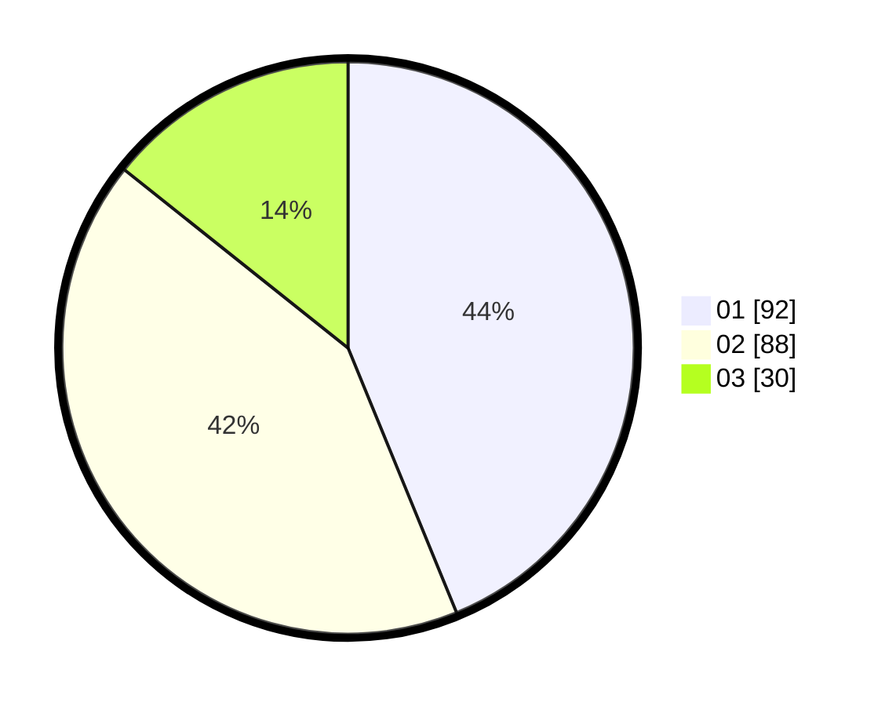

# Hasil

Hasil perolehan suara paslon dapat dilihat pada file paslon-01.txt, paslon-02.txt, dan paslon-03.txt.

Jika tidak ada, artinya data tersebut belum ada pada SIREKAP.

## Perolehan Suara

 * Paslon 01: **92**.
 * Paslon 02: **88**.
 * Paslon 03: **30**.

## Foto C Plano

https://sirekap-obj-formc.kpu.go.id/feb5/pemilu/ppwp/31/75/03/10/06/3175031006167-20240214-205101--efb1bf86-59dc-41b5-8785-62af64c8c6fa.jpg

https://sirekap-obj-formc.kpu.go.id/feb5/pemilu/ppwp/31/75/03/10/06/3175031006167-20240214-205202--3f9232ae-4828-40e9-ae0c-92385ad1e6b0.jpg

https://sirekap-obj-formc.kpu.go.id/feb5/pemilu/ppwp/31/75/03/10/06/3175031006167-20240214-205304--9f5a071a-3025-4b9b-9815-111d1dcac124.jpg

## DATA PEMILIH TETAP

Jumlah pemilih dalam DPT: **266**.
 * L: **123**.
 * P: **143**.

## DATA PENGGUNA HAK PILIH

Jumlah pengguna hak pilih dalam DPT: **212**.
 * L: **93**.
 * P: **119**.

Jumlah pengguna hak pilih dalam DPTb: **0**.
 * L: **0**.
 * P: **0**.

Jumlah pengguna hak pilih dalam DPK: **4**.
 * L: **2**.
 * P: **2**.

Jumlah pengguna hak pilih: **216**.
 * L: **95**.
 * P: **121**.

## JUMLAH SUARA SAH DAN TIDAK SAH

JUMLAH SELURUH SUARA SAH: **210**.

JUMLAH SUARA TIDAK SAH: **6**.

JUMLAH SELURUH SUARA SAH DAN SUARA TIDAK SAH: **216**.
