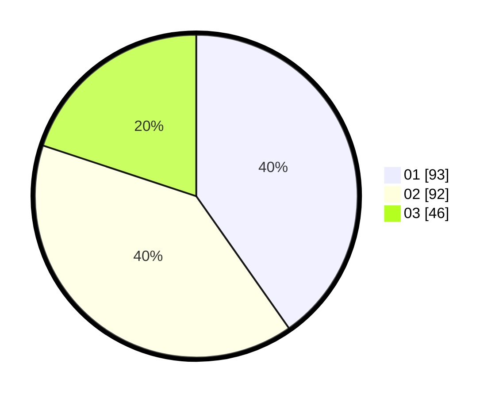

# Hasil

Hasil perolehan suara paslon dapat dilihat pada file paslon-01.txt, paslon-02.txt, dan paslon-03.txt.

Jika tidak ada, artinya data tersebut belum ada pada SIREKAP.

## Perolehan Suara

 * Paslon 01: **93**.
 * Paslon 02: **92**.
 * Paslon 03: **46**.

## Foto C Plano

https://sirekap-obj-formc.kpu.go.id/d3a2/pemilu/ppwp/31/75/03/10/06/3175031006170-20240214-220944--67c2092d-4246-4a4e-bbc0-3bd3f373f368.jpg

https://sirekap-obj-formc.kpu.go.id/d3a2/pemilu/ppwp/31/75/03/10/06/3175031006170-20240214-191917--f70e5607-3eec-40a2-9405-860afe64ffb2.jpg

https://sirekap-obj-formc.kpu.go.id/d3a2/pemilu/ppwp/31/75/03/10/06/3175031006170-20240214-191952--6dd65310-0690-4bb8-98c3-f21e30e0f61e.jpg
