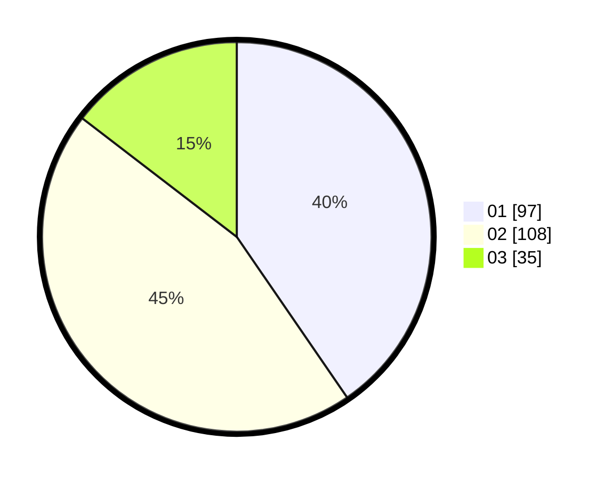

# Hasil

Hasil perolehan suara paslon dapat dilihat pada file paslon-01.txt, paslon-02.txt, dan paslon-03.txt.

Jika tidak ada, artinya data tersebut belum ada pada SIREKAP.

## Perolehan Suara

 * Paslon 01: **97**.
 * Paslon 02: **108**.
 * Paslon 03: **35**.

## Foto C Plano

https://sirekap-obj-formc.kpu.go.id/628a/pemilu/ppwp/31/75/03/10/06/3175031006171-20240218-080802--99f2105c-789d-4cde-bb2e-8b70d02d1542.jpg

https://sirekap-obj-formc.kpu.go.id/628a/pemilu/ppwp/31/75/03/10/06/3175031006171-20240215-001411--38f7a3fb-91d0-4cd4-8213-6491e9ac308e.jpg

https://sirekap-obj-formc.kpu.go.id/628a/pemilu/ppwp/31/75/03/10/06/3175031006171-20240218-080803--d9972ad9-f214-4366-8e27-123ca412c78a.jpg

## DATA PEMILIH TETAP

Jumlah pemilih dalam DPT: **282**.
 * L: **137**.
 * P: **145**.

## DATA PENGGUNA HAK PILIH

Jumlah pengguna hak pilih dalam DPT: **234**.
 * L: **113**.
 * P: **121**.

Jumlah pengguna hak pilih dalam DPTb: **6**.
 * L: **2**.
 * P: **4**.

Jumlah pengguna hak pilih dalam DPK: **0**.
 * L: **0**.
 * P: **0**.

Jumlah pengguna hak pilih: **240**.
 * L: **115**.
 * P: **125**.

## JUMLAH SUARA SAH DAN TIDAK SAH

JUMLAH SELURUH SUARA SAH: **240**.

JUMLAH SUARA TIDAK SAH: **0**.

JUMLAH SELURUH SUARA SAH DAN SUARA TIDAK SAH: **240**.
