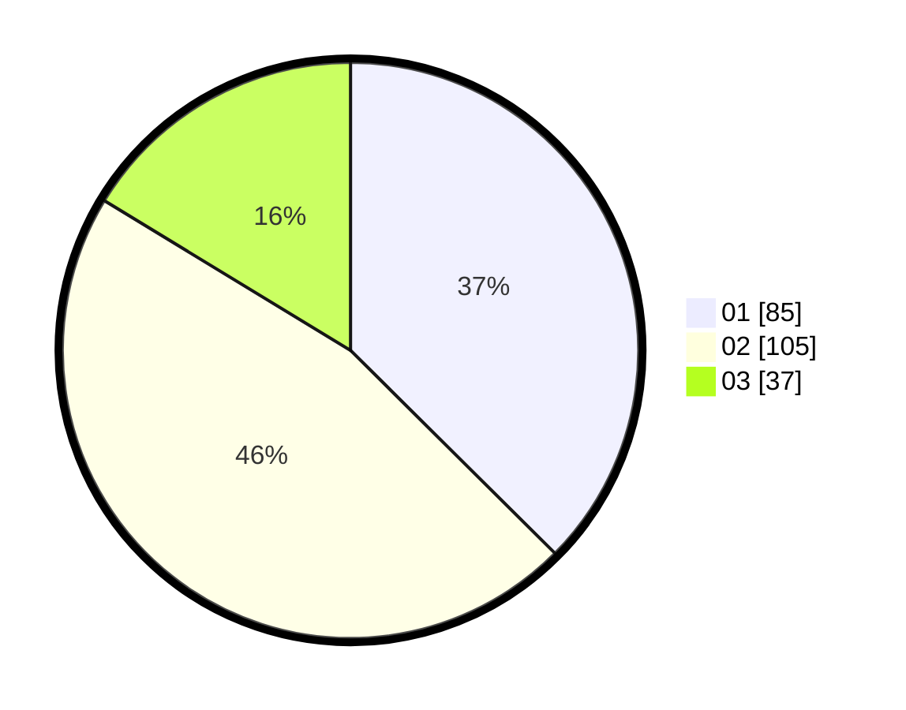

# Hasil

Hasil perolehan suara paslon dapat dilihat pada file paslon-01.txt, paslon-02.txt, dan paslon-03.txt.

Jika tidak ada, artinya data tersebut belum ada pada SIREKAP.

## Perolehan Suara

 * Paslon 01: **85**.
 * Paslon 02: **105**.
 * Paslon 03: **37**.

## Foto C Plano

https://sirekap-obj-formc.kpu.go.id/e677/pemilu/ppwp/31/75/03/10/06/3175031006172-20240215-031551--f5a3fcdd-c82c-4f30-88c6-1634876f9992.jpg

https://sirekap-obj-formc.kpu.go.id/e677/pemilu/ppwp/31/75/03/10/06/3175031006172-20240215-031557--6cfff058-0ef3-4d61-8ffe-f7394b43d281.jpg

https://sirekap-obj-formc.kpu.go.id/e677/pemilu/ppwp/31/75/03/10/06/3175031006172-20240215-031601--538ff46f-df05-4e3a-82f8-86d79f875a4e.jpg

## DATA PEMILIH TETAP

Jumlah pemilih dalam DPT: **284**.
 * L: **148**.
 * P: **136**.

## DATA PENGGUNA HAK PILIH

Jumlah pengguna hak pilih dalam DPT: **226**.
 * L: **115**.
 * P: **111**.

Jumlah pengguna hak pilih dalam DPTb: **0**.
 * L: **0**.
 * P: **0**.

Jumlah pengguna hak pilih dalam DPK: **1**.
 * L: **1**.
 * P: **0**.

Jumlah pengguna hak pilih: **227**.
 * L: **116**.
 * P: **111**.

## JUMLAH SUARA SAH DAN TIDAK SAH

JUMLAH SELURUH SUARA SAH: **227**.

JUMLAH SUARA TIDAK SAH: **0**.

JUMLAH SELURUH SUARA SAH DAN SUARA TIDAK SAH: **227**.
